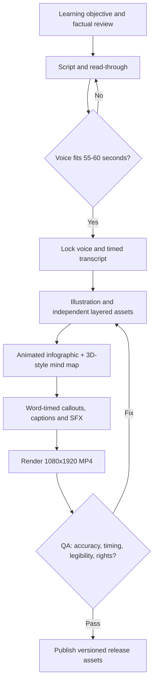

# AI 60-Second Educational Video Studio

Reusable, stage-gated production kit for a **60-second, 9:16 educational Short** combining **animated infographic diagrams and an animated 3D-style mind map**. Pilot topic: *How AI works in 60 seconds*.

**Status:** Preproduction blueprint. The actual narrated, animated MP4 has **not** been rendered or published. Generated reference illustrations are not a layered animation project. No voice model, licensing rights, AI-video subscription or generated outputs are presumed available.

## Start here
1. Read [00_PLAN.md](00_PLAN.md), including the review and acceptance gates.
2. Read [01_SCRIPT_AND_SHOTS.md](01_SCRIPT_AND_SHOTS.md); record a scratch narration and check spoken timing before locking images.
3. Use [02_ASSET_AND_ANIMATION_SPEC.md](02_ASSET_AND_ANIMATION_SPEC.md) to redraw individual visual objects as layers, then animate them to narration.
4. Track the actual status and provenance in [03_PRODUCTION_LOG_TEMPLATE.md](03_PRODUCTION_LOG_TEMPLATE.md) *for every attempt*, not just successes.
5. Run [04_QA_AND_RELEASE.md](04_QA_AND_RELEASE.md) before releasing to YouTube.

## Repeatable pipeline


## Recommended layout
```
AI_60_Second_Educational_Video/
  README.md
  00_PLAN.md
  01_SCRIPT_AND_SHOTS.md
  02_ASSET_AND_ANIMATION_SPEC.md
  03_PRODUCTION_LOG_TEMPLATE.md
  04_QA_AND_RELEASE.md
  projects/ai-explained-001/
    script/          # approved script, timed narration transcript
    audio/           # voice, music and SFX licenses
    references/      # reference images with provenance
    assets/          # separately editable elements
    scenes/          # scene source/project files
    renders/         # per-scene previews, never only final MP4
    qa/              # actual test outputs and human review
    release/         # final MP4, SRT, thumbnail, description
```
Create project subfolders locally when production starts. Empty folders are not committed.

## Revisions without repeating the whole process
A changed sentence invalidates voice timings and the linked animation cues, but **not** unrelated asset layers. A changed diagram invalidates only that scene's rendered preview and QA. Keep a manifest with asset SHA-256, source prompt, model/tool/version, rights/license, scene number and approval status. Record open issues and the exact stage to resume in the production log. Never commit secrets, browser cookies, login tokens, private source video, or unlicensed third-party footage.

## Tools are interchangeable
Script: text editor; diagrams: SVG/Inkscape or equivalent; animation: Blender, DaVinci Resolve/Fusion, After Effects, or programmatic SVG/compositing; voice: properly licensed human narration or reviewed TTS; final encode: FFmpeg. Favor editable vector text and arrows over AI-rendered tiny text. A flat illustrated *3D-style* mind map is not the same as a real Blender 3D scene: choose and document the actual technique.

No claim that the specific tools above were used by the source YouTube creator. See [04_QA_AND_RELEASE.md](04_QA_AND_RELEASE.md) for release criteria.
