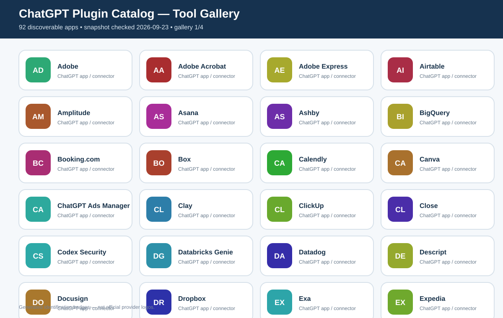
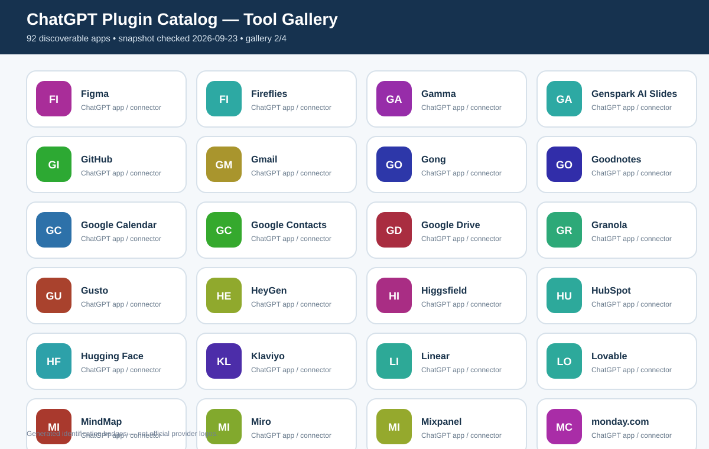
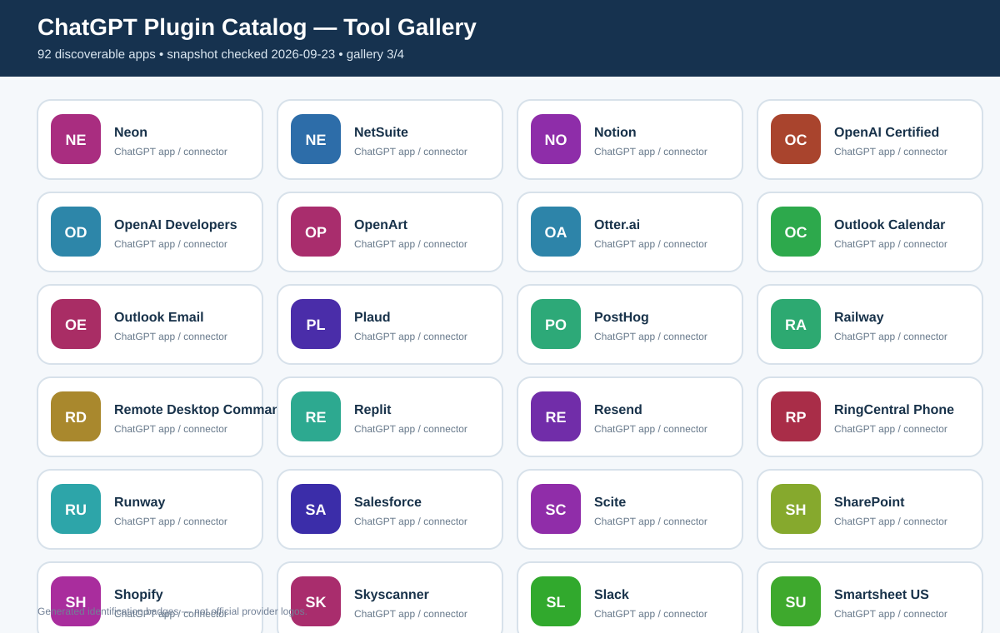
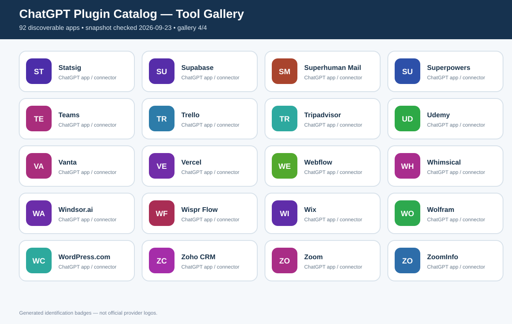

# ChatGPT Plugin Catalog

A point-in-time catalog of ChatGPT apps/connectors discovered on **2026-09-23**.

The source workbook prepared for this catalog contains **92 apps/plugins** and tracks:

- app/plugin name
- category
- purpose
- current directory availability
- whether it was installed at the time of the check
- provider free-plan model
- known free allowance / quota
- whether the ChatGPT/MCP connector itself is known to work on the free provider plan
- paid/trial notes
- confidence level
- provider/pricing source URLs
- plugin ID and checked date

> **Important:** the ChatGPT app/plugin directory is dynamic. Availability can differ by account, region, administrator policy and rollout. Provider prices and quotas also change. Treat this as a dated research snapshot, not a permanent compatibility matrix.

## Visual gallery

The images below show all 92 discovered tools as generated identification badges. They are **not official provider logos**.

## What “free” means

The catalog deliberately separates the provider's free plan from the connector itself.

A provider can offer a free website/app account while its ChatGPT/MCP integration is restricted to a paid plan. The catalog therefore uses separate fields for:

1. **Provider free model** — free forever, free tier, trial, free-to-search marketplace, paid-only, or unclear.
2. **Free limit / allowance** — the best documented quota available at the checked date.
3. **Connector usable on free provider plan?** — whether the integration itself is known to work at the free tier.

Where no connector-specific quota was publicly documented, the catalog says **unknown / plan-dependent** rather than inventing a number.

## Snapshot highlights

At the time of the scan:

- **92 distinct apps/connectors** were found through broad directory discovery.
- Most were reported as available for installation.
- **GitHub** was already installed on the connected ChatGPT account.
- **BigQuery** and **Salesforce** were reported as unavailable/admin-disabled in that specific environment.
- The catalog includes productivity, documents, design, development, databases, analytics, CRM, marketing, travel, meetings, research, e-commerce and other categories.

## Tool list

See [PLUGIN_INDEX.md](./PLUGIN_INDEX.md) for the complete alphabetical list of all 92 apps.

## Spreadsheet

The primary spreadsheet is named:

`ChatGPT_Plugins_Catalog_2026-09-23.xlsx`

It contains:

- **Plugin Catalog** — filterable master table with the research fields and visual badges
- **Summary** — high-level counts
- **Notes** — methodology and caveats

The workbook should be regenerated/rechecked whenever a new snapshot is published because pricing and directory availability change frequently.

## Image note

The repository gallery uses generated text/initial badges so the project does not redistribute third-party brand artwork without an explicit need. Product names and trademarks belong to their respective owners.

## License

Repository documentation and helper assets in this folder are provided under the [MIT License](./LICENSE).

Third-party services, product names, trademarks, pricing pages, APIs and connected data remain subject to their respective owners' terms and licenses.
