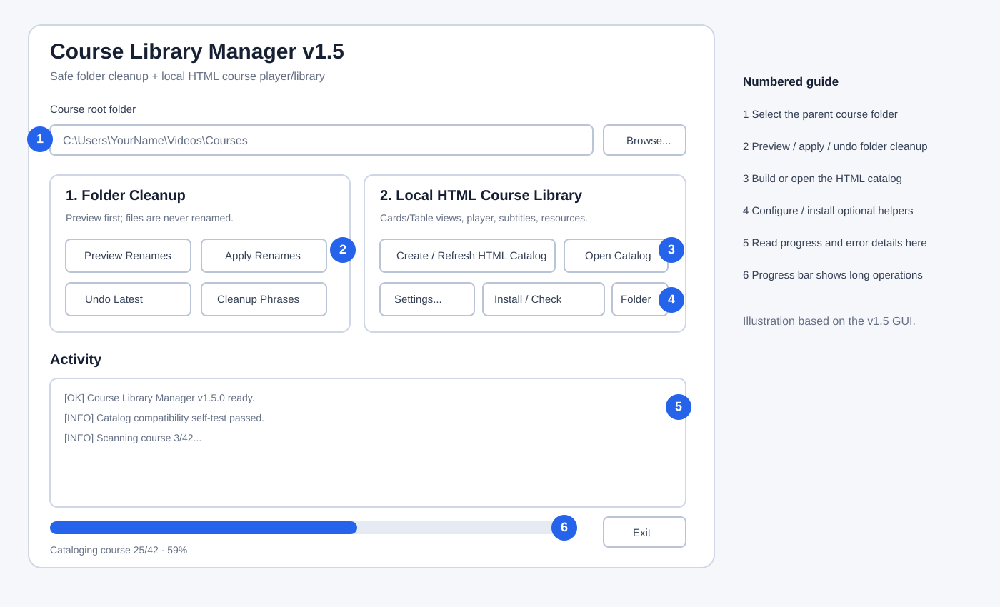
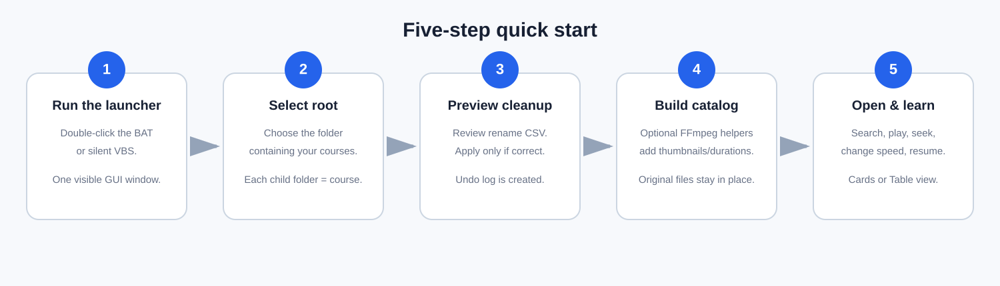
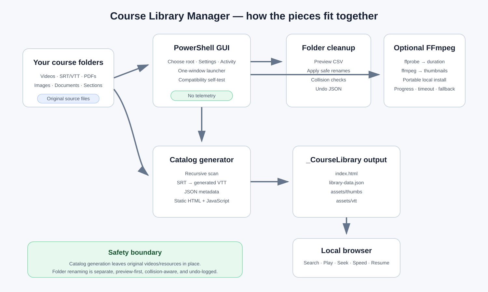
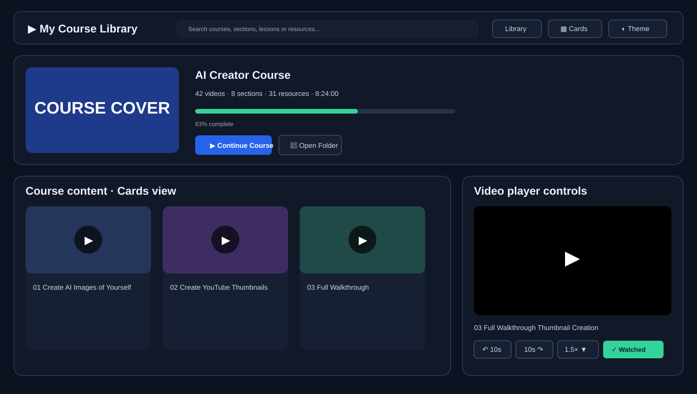

# Course Library Manager

A **Windows PowerShell GUI** for cleaning messy course-folder names and turning a local collection of videos, subtitles, PDFs, images, and other learning resources into a searchable **offline HTML course library**.

The application is designed for people who are comfortable double-clicking a Windows launcher but do not want to write scripts or maintain a database. Folder renaming is preview-first, catalog generation does not rename source files, and the generated HTML library runs locally in a normal web browser.

> **Safety:** the folder-cleanup feature renames **folders only**, never lesson files. It creates preview/apply reports and an undo log. HTML catalog generation reads the course collection and writes generated files into `_CourseLibrary`; it does not delete or overwrite your original videos, subtitles, PDFs, or images.



## What it does

- cleans slug-like top-level course folder names into readable titles;
- removes user-configured source/channel/site phrases from folder names;
- keeps numbered lesson/section structure such as `01 - Introduction`;
- previews folder changes before applying them;
- creates an undo log for applied folder renames;
- builds a local HTML course library with **card** and **table** views;
- plays local videos with seeking, `-10/+10` second controls, speed control, fullscreen, mute, previous/next, watched state, and resume position;
- converts matching `.srt` subtitles to browser-friendly `.vtt` copies inside the generated catalog;
- shows PDFs, images, and other resources alongside course videos;
- uses a root-level course cover when available and can create cached video thumbnails with FFmpeg;
- remembers playback progress in browser `localStorage`;
- can install a portable copy of FFmpeg/ffprobe into the application folder when those optional media helpers are missing;
- keeps normal operation in **one visible GUI window**.

## Quick start

### Requirements

- Windows 10 or Windows 11
- Windows PowerShell 5.1 or newer
- a local folder containing one subfolder per course
- a modern browser such as Edge, Firefox, or Chrome for the generated HTML catalog
- internet access only if you choose to let the app download portable FFmpeg/ffprobe

No Python installation is required. Administrator rights are not normally required.

### Run the application

1. Download the complete **`Course-Library-Manager`** folder.
2. Keep the files together.
3. Double-click **`RUN_COURSE_LIBRARY_MANAGER.bat`**.
4. If you prefer a launcher with no console flash at all, use **`RUN_COURSE_LIBRARY_MANAGER_SILENT.vbs`**.
5. Click **Browse** and select the folder that contains your course folders.
6. Use **Preview Folder Renames** before applying any naming changes.
7. Click **Create / Refresh HTML Catalog**.
8. Click **Open Catalog** when the build is complete.



For a more detailed walkthrough, see [docs/QUICK_START.md](./docs/QUICK_START.md).

## Understanding the GUI

| Area | Purpose |
|---|---|
| Course root folder | The parent directory that contains your individual course folders |
| Preview Folder Renames | Scans proposed folder-name changes and writes a CSV without changing anything |
| Apply Folder Renames | Applies only the safe, non-colliding folder changes and writes an undo log |
| Undo Latest Rename | Reverses the most recent completed folder-rename run |
| Cleanup Phrases | One phrase per line for source/channel/site text you want stripped from folder names |
| Create / Refresh HTML Catalog | Scans the course library and regenerates `_CourseLibrary/index.html` |
| Open Catalog | Opens the generated local library in your default browser |
| Install / Check Components | Detects or installs portable FFmpeg/ffprobe for thumbnails and duration metadata |
| Catalog Settings | Controls theme, default view, thumbnails, durations, subtitles, resources, and default playback speed |
| Activity | Plain-text progress and diagnostics |
| Progress bar | Download/catalog-build progress |

## Visual workflow



The application deliberately keeps **folder cleanup** and **catalog generation** separate. You can build the HTML library without applying folder renames.

## HTML course library

The generated browser interface contains a master course library and a course detail/player page.



### Player controls

- normal HTML5 seek/timeline bar;
- `-10 seconds` and `+10 seconds`;
- playback speeds from `0.5x` through `3x`;
- native volume/mute and fullscreen;
- English subtitle track when a matching `.srt`/`.vtt` exists;
- previous/next lesson;
- mark watched;
- continue/resume from the previous position;
- keyboard controls: `Space`/`K` play-pause, `J`/Left back 10 seconds, `L`/Right forward 10 seconds, `M` mute, `F` fullscreen.

> Browser codec support still applies. A browser can only play formats/codecs it supports. The **Open File** action remains available when browser playback is not suitable.

## Expected course layout

```text
Courses
├── Course A
│   ├── cover.jpg
│   ├── 01 - Introduction
│   │   ├── 001 Welcome.mp4
│   │   └── 001 Welcome_en.srt
│   ├── 02 - Main Lessons
│   │   ├── 001 Lesson.mp4
│   │   ├── 001 Lesson_en.srt
│   │   └── worksheet.pdf
│   └── resources.pdf
└── Course B
    └── ...
```

Each immediate child of the selected root is treated as a course. Subfolders are treated as sections/resources.

## Course-cover selection

The generator checks **root-level images inside each course** first. It prefers names such as `cover`, `course cover`, `poster`, or `thumbnail`. It intentionally avoids choosing arbitrary images buried inside lesson folders because those are often screenshots or lesson resources rather than course artwork.

When there is no suitable root-level cover and FFmpeg thumbnail generation is enabled, the first generated video thumbnail can be used as the course visual.

## FFmpeg and ffprobe

FFmpeg is **optional** but improves the catalog.

- `ffprobe` reads video duration.
- `ffmpeg` creates cached video-card thumbnails.
- the GUI can download a portable Windows build into `tools/ffmpeg/bin`;
- the installer displays percentage, downloaded size, speed, ETA, extraction, install, and verification progress;
- connection/read timeouts and a fallback download source are included;
- if installation fails, catalog creation can continue without generated thumbnails/durations.

See [THIRD_PARTY_NOTICES.md](./THIRD_PARTY_NOTICES.md) before redistributing downloaded third-party binaries.

## Files created by the application

```text
_CourseLibrary/
├── index.html
├── library-data.json
├── build-report.json
└── assets/
    ├── thumbs/
    └── vtt/
```

Folder-renaming operations can additionally create timestamped preview/apply CSVs and undo JSON files. These runtime artifacts are excluded by the tool's `.gitignore`.

## Privacy and network behavior

The course inventory, playback history, generated HTML, subtitles, and thumbnails stay on the local computer. The application does not include telemetry or an analytics service.

The only built-in network operation is the **optional** portable FFmpeg download when the user enables media-helper features and those executables are not already available.

## Safety model

- Preview-first for folder renaming.
- Existing destination-name collisions are skipped rather than overwritten.
- Original course files are not renamed by the cleanup workflow.
- Catalog output lives in a separate `_CourseLibrary` directory.
- Subtitle conversion creates `.vtt` copies and leaves original `.srt` files intact.
- Generated video thumbnails are cached separately.
- The app performs an internal catalog-compatibility self-test before scanning a real library.
- FFmpeg is installed locally beside the application rather than system-wide.

## Troubleshooting

Start with [docs/TROUBLESHOOTING.md](./docs/TROUBLESHOOTING.md). Common checks include:

- confirm the Activity panel says `Course Library Manager v1.5.0 ready`;
- use **Install / Check Components** if thumbnails or durations are missing;
- make sure the selected root actually contains course subfolders;
- check `_CourseLibrary/build-report.json` after a catalog build;
- use the non-silent `.ps1` launch only when debugging a PowerShell-level problem.

## Testing and compatibility

The source includes a pre-build compatibility test for the PowerShell/list/JSON/HTML path used by the catalog generator. Repository CI also parses PowerShell source on pushes and pull requests.

See [TESTING.md](./TESTING.md) for the current validation scope and limitations.

## Project files

| File | Purpose |
|---|---|
| `Course_Library_Manager.ps1` | Main WinForms GUI and catalog generator |
| `RUN_COURSE_LIBRARY_MANAGER.bat` | Normal one-window launcher |
| `RUN_COURSE_LIBRARY_MANAGER_SILENT.vbs` | Completely silent launcher alternative |
| `README.md` | Main user documentation |
| `docs/QUICK_START.md` | Detailed beginner walkthrough |
| `docs/ARCHITECTURE.md` | Technical architecture and generated-data flow |
| `docs/TROUBLESHOOTING.md` | Common problems and diagnostic steps |
| `TESTING.md` | Validation scope and known test limitations |
| `THIRD_PARTY_NOTICES.md` | FFmpeg/build-provider attribution and licensing note |
| `SECURITY.md` | Tool-specific security and privacy guidance |
| `CHANGELOG.md` | Tool history |
| `LICENSE` | MIT license for this project's own source/documentation |

## Known limitations

- Windows-only GUI.
- Windows PowerShell 5.1 is the primary compatibility target.
- Browser playback depends on browser codec support.
- Video duration/thumbnail generation is richer with FFmpeg/ffprobe.
- `localStorage` playback progress belongs to the browser/profile that opened the catalog.
- Physical file/folder names are not changed by catalog display-title cleanup.
- Very large libraries can take time to scan when duration probing and thumbnail generation are enabled. Cached thumbnails reduce later rebuild work.

## License

The Course Library Manager source code and project documentation are licensed under the [MIT License](./LICENSE).

FFmpeg and third-party Windows builds/download sources are **not relicensed under MIT**. They remain governed by their own licenses and distribution terms. See [THIRD_PARTY_NOTICES.md](./THIRD_PARTY_NOTICES.md).

## Contributing and support

This tool is part of the [`gbansal86/mytools`](https://github.com/gbansal86/mytools) repository. Repository-wide contribution, support, governance, and security policies apply.
