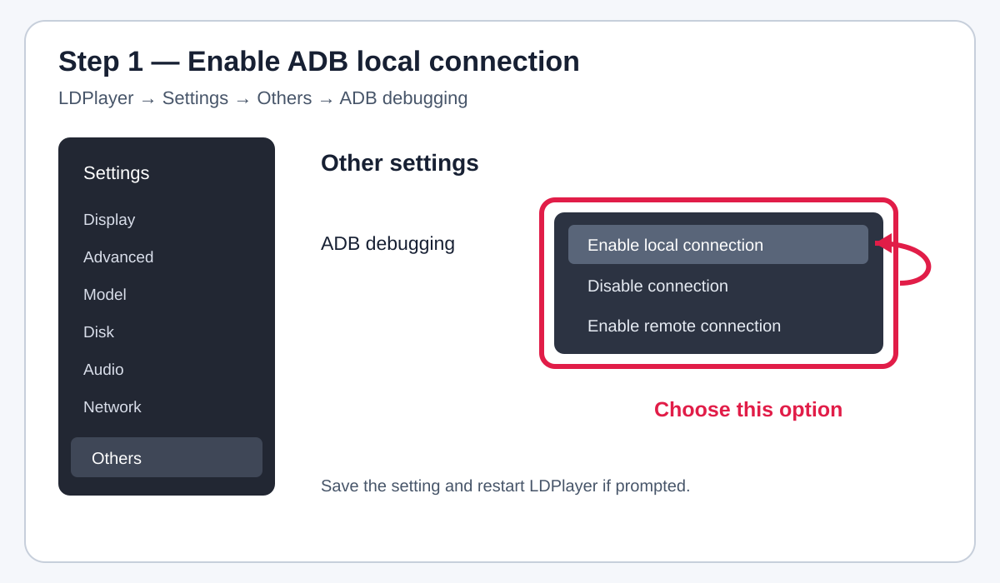
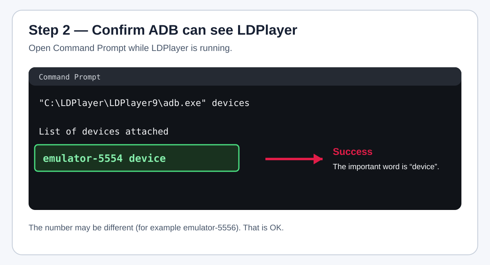
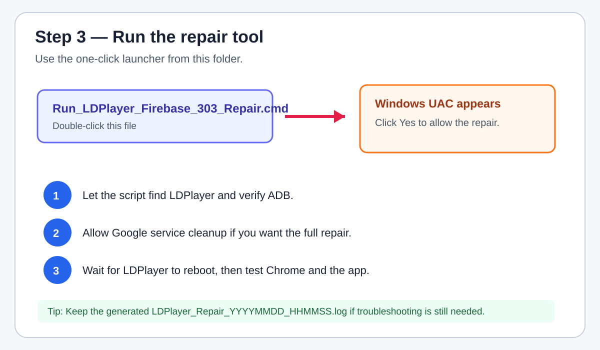
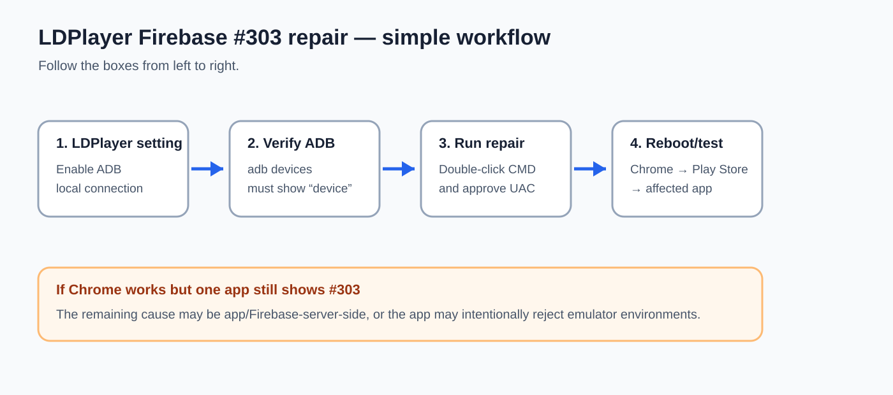

# LDPlayer Firebase #303 / Internet Repair

A beginner-friendly Windows repair utility for LDPlayer 9 when an Android app reports an error similar to:

> **App configuration failed #303**  
> **Firebase Installations failed to get installation auth token for fetch**

The tool focuses on the common local causes: LDPlayer ADB access, Android proxy/Private DNS settings, device time, Google Play Services state, and basic Windows network state.

> **Important:** Error #303 may also be caused by the app developer's Firebase configuration or a server-side problem. This utility repairs the PC/emulator side; it cannot repair a broken Firebase project owned by the app developer.

---

## Quick start

1. Download this folder.
2. Start **LDPlayer 9**.
3. In LDPlayer open **Settings → Others → ADB debugging**.
4. Choose **Enable local connection**, then save/restart LDPlayer if prompted.
5. Double-click **Run_LDPlayer_Firebase_303_Repair.cmd**.
6. Accept the Windows Administrator/UAC prompt.
7. Follow the plain-English questions.
8. Let LDPlayer reboot.
9. Wait 1–2 minutes, then test Chrome, Google Play Store, and the affected app.

A healthy ADB connection normally looks like:

```text
List of devices attached
emulator-5554    device
```

The exact emulator number can be different. The important word is **device**.

---


## Visual step-by-step guide

### Step 1 — Enable ADB local connection

Open **LDPlayer → Settings → Others → ADB debugging** and choose **Enable local connection**.



### Step 2 — Confirm ADB can see LDPlayer

Open **Command Prompt** while LDPlayer is running and execute:

```cmd
"C:\LDPlayer\LDPlayer9\adb.exe" devices
```

You want to see a line ending in **device**, for example:

```text
emulator-5554    device
```



### Step 3 — Run the repair

Double-click:

```text
Run_LDPlayer_Firebase_303_Repair.cmd
```

Accept the Windows Administrator/UAC prompt and follow the questions shown by the script.



### Step 4 — Let LDPlayer reboot and test

After the repair finishes:

1. Wait 1–2 minutes for LDPlayer to boot.
2. Open Chrome in LDPlayer and test a website.
3. Open Google Play Store and sign in again if requested.
4. Test the app that previously showed **App configuration failed #303**.
5. Keep the generated `LDPlayer_Repair_YYYYMMDD_HHMMSS.log` if the problem remains.

### Full workflow at a glance



## What the repair does

The PowerShell script is heavily commented so a non-programmer can see what each step is doing.

| Step | What it does | Why |
|---|---|---|
| 1 | Finds LDPlayer and its bundled `adb.exe` | Avoids requiring a separate Android SDK installation |
| 2 | Checks Windows Administrator access | Some Windows repair commands need elevation |
| 3 | Resets WinHTTP proxy and flushes DNS | Removes common stale proxy/DNS problems |
| 4 | Resynchronizes Windows time | Authentication tokens can fail when system time is wrong |
| 5 | Starts/reconnects ADB | Allows the script to talk to Android inside LDPlayer |
| 6 | Tries common LDPlayer localhost ADB ports | Helps when `adb devices` initially shows nothing |
| 7 | Clears Android HTTP proxy settings | Removes emulator-side proxy misconfiguration |
| 8 | Temporarily turns Android Private DNS off | Eliminates Private DNS as a test variable |
| 9 | Enables automatic Android time/time zone | Helps TLS/authentication/token requests |
| 10 | Tests IP and DNS reachability from Android | Separates “no Internet” from “DNS problem” |
| 11 | Optionally clears Google Play components | Rebuilds corrupted Google/Firebase-related local state |
| 12 | Optionally clears one affected app | Recreates that app's local Firebase installation state |
| 13 | Reboots Android | Applies the repaired state cleanly |
| 14 | Writes a timestamped log | Makes troubleshooting easier |

---

## What it deliberately does NOT do

For safety, this tool does **not** automatically:

- install or remove LDPlayer/VirtualBox bridge drivers;
- modify Windows firewall rules;
- disable antivirus software;
- install certificates;
- edit the Windows registry;
- root the emulator;
- change your router;
- permanently force Windows DNS to a public DNS provider;
- delete arbitrary Android apps.

Those actions are not required for the normal repair path and can create unrelated problems.

---

## Google data warning

If you choose to clear Google service data, the script clears these Android packages:

- `com.android.vending` — Google Play Store
- `com.google.android.gms` — Google Play Services
- `com.google.android.gsf` — Google Services Framework

This can make Google Play ask you to sign in again. It does **not** delete Windows files.

If you provide an affected app package and choose to clear it, Android will reset that app's local data. Do this only if you are comfortable signing in/configuring the app again.

---

## How to find an app package name

If you know part of the app name, open Command Prompt while LDPlayer is running:

```cmd
"C:\LDPlayer\LDPlayer9\adb.exe" shell pm list packages | findstr /i keyword
```

Example:

```cmd
"C:\LDPlayer\LDPlayer9\adb.exe" shell pm list packages | findstr /i telegram
```

You can also skip this entirely. The main Google/Firebase repair can run without clearing the affected app.

---

## Manual ADB check

If the tool says that Android was not found:

```cmd
"C:\LDPlayer\LDPlayer9\adb.exe" kill-server
"C:\LDPlayer\LDPlayer9\adb.exe" start-server
"C:\LDPlayer\LDPlayer9\adb.exe" devices
```

If the list is empty, first verify:

**LDPlayer → Settings → Others → ADB debugging → Enable local connection**

Then retry.

The script also tries common localhost ports automatically.

---

## How to tell what kind of problem you have

### Chrome inside LDPlayer cannot open websites

This points toward a general emulator/network issue. Run the script and check the generated log. If necessary, see [TROUBLESHOOTING.md](./TROUBLESHOOTING.md).

### Chrome works, but only one app shows #303

This is less likely to be a Windows Internet problem. The useful repair path is usually:

1. verify ADB;
2. correct Android proxy/Private DNS/time;
3. clear Google Play Services-related state;
4. optionally clear only the affected app;
5. reboot LDPlayer.

If the same app still fails in a brand-new LDPlayer instance while other Internet apps work, the problem may be app-side/Firebase-side rather than your PC.

---

## Optional full Windows network reset

The normal script intentionally performs only low-risk Windows network cleanup.

For a deeper reset, run PowerShell as Administrator:

```powershell
netsh winsock reset
```

Then restart Windows.

Do this only when LDPlayer has a general Internet problem. A Winsock reset is usually unnecessary when Chrome/Play Store already work in the emulator.

---

## Re-enable Android Private DNS later

The repair temporarily sets Android Private DNS to `off` to eliminate DNS-over-TLS configuration as a cause.

To restore Android's normal opportunistic mode:

```cmd
"C:\LDPlayer\LDPlayer9\adb.exe" shell settings put global private_dns_mode opportunistic
```

---

## Files in this folder

| File | Purpose |
|---|---|
| `Run_LDPlayer_Firebase_303_Repair.cmd` | Double-click launcher |
| `Fix_LDPlayer_Firebase_303.ps1` | Main annotated repair script |
| `TROUBLESHOOTING.md` | Symptom-by-symptom diagnostics |
| `TECHNICAL_NOTES.md` | Exact commands, design choices, and safety notes |
| `CHANGELOG.md` | Version history |

---

## Requirements

- Windows 10 or Windows 11
- LDPlayer 9 installed
- LDPlayer ADB debugging set to **Enable local connection**
- Administrator access for the Windows-side cleanup
- PowerShell 5.1 or newer

No Python, Android Studio, or separate ADB installation is required when LDPlayer's bundled `adb.exe` is available.

---

## Limitations

This tool cannot fix:

- a Firebase project misconfigured by the app developer;
- revoked/invalid app credentials on a remote service;
- a remote server outage;
- an app intentionally blocking emulators;
- account bans/restrictions;
- ISP/router policies outside the PC.

The generated log is the best next artifact to inspect if the problem remains.
