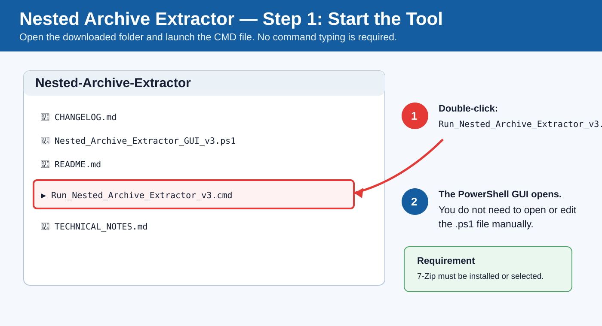
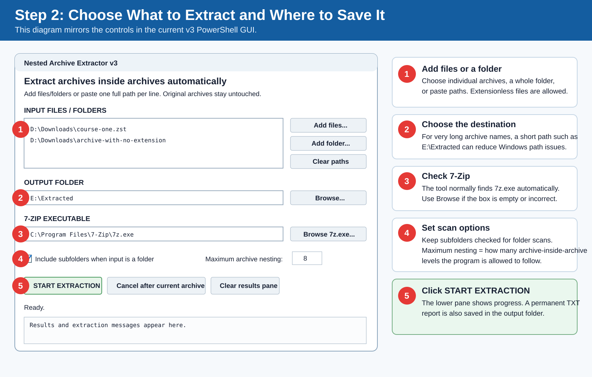

# Nested Archive Extractor GUI

A beginner-friendly Windows PowerShell GUI for extracting **archives inside archives** in one run.

It was created for cases such as:

```text
course.zst
└── extensionless-file        ← actually a 7Z/RAR/ZIP/TAR archive
    └── final course files
```

Instead of manually extracting the outer archive, finding the inner archive, and extracting again, this tool performs the chain automatically.

## What it does

- Lets you select **one or many files**
- Lets you add an **entire folder**
- Lets you paste full file/folder paths directly into the GUI
- Can scan subfolders
- Uses 7-Zip to identify and extract supported archive formats
- Detects many **extensionless archives** by asking 7-Zip to inspect the file
- Recursively extracts nested archives up to a user-selected maximum depth
- Shows live progress and results in the GUI
- Writes a detailed TXT report to the destination folder
- Keeps the original input archives unchanged
- Uses a short temporary working folder to reduce Windows path-length problems
- Preserves temporary recovery data when a nested extraction fails

## Supported formats

The GUI is designed around formats supported by the selected 7-Zip executable, including:

- 7Z
- RAR
- ZIP
- ZST / Zstandard
- TAR
- GZ / TGZ
- XZ / TXZ
- BZ2 / TBZ2
- TZST
- Extensionless archive files when 7-Zip recognizes their contents

Actual support depends on the installed 7-Zip version.

## Requirements

### Required

1. Windows 10 or Windows 11
2. Windows PowerShell 5.1 or newer
3. 7-Zip
4. For `.zst` / Zstandard files, use a current 7-Zip release. Version 24.01 or newer is recommended.

The script accepts:

- `7z.exe`
- `7zz.exe`

Do **not** select `7zFM.exe`. The GUI is looking for the command-line extractor.

The launcher also deliberately rejects `7za.exe` because its available format support may differ from the full installation.

## Installation

### Easiest method

1. Install 7-Zip from the official 7-Zip website.
2. Download this folder.
3. Double-click:

```text
Run_Nested_Archive_Extractor.cmd
```

No Python installation is required.

## Visual step-by-step guide

### Step 1 — Start the tool

Open the extracted `Nested-Archive-Extractor` folder and double-click `Run_Nested_Archive_Extractor_v3.cmd`.



### Step 2 — Select files, output folder, and settings

1. Add one or more archive files, add a folder, or paste full paths.
2. Choose the destination where final extracted files should be saved.
3. Confirm the 7-Zip executable. The tool normally finds `7z.exe` automatically.
4. Keep **Include subfolders** enabled when scanning folders if required.
5. Leave **Maximum archive nesting** at 8 unless you know your archives are nested more deeply.
6. Click **START EXTRACTION**.



### Step 3 — Watch progress and check the result

The lower results pane shows each extraction stage. The same messages are written to a TXT report in the selected output folder.

- `OUTER` = an input archive is being processed.
- `UNWRAP` = a single-file compression wrapper such as ZST was opened and another archive was detected inside.
- `NESTED` = another archive was found inside the current archive.
- `FILE` = a final non-archive file was produced.
- `OK` = that archive chain completed successfully.
- `PARTIAL` or `FAILED` = check the report for the failed layer.
- `RECOVER` = temporary working files were kept so they can be inspected.


> **Tip:** For archives with very long names, choose a short output path such as `E:\Extracted` to reduce Windows path-length problems.

## How to use

1. Click **Add files...** to select one or more archive files.

   You can select files with normal extensions such as `.7z`, `.rar`, `.zip`, or `.zst`. You can also select a file with **no extension**.

2. Or click **Add folder...** to scan a whole folder.

3. You may also paste paths directly into **INPUT FILES / FOLDERS**.

   Use one full path per line.

4. Choose the **OUTPUT FOLDER**.

5. Confirm the **7-ZIP EXECUTABLE** field points to `7z.exe` or `7zz.exe`.

6. Leave **Include subfolders** enabled if archives can be below the selected folder.

7. Set **Maximum archive nesting**.

   The default is 8. This means the program will continue opening nested archives for up to eight archive levels.

8. Click **START EXTRACTION**.

9. Watch the results pane.

10. When finished, open the TXT report shown in the GUI for the complete log.

## What the GUI buttons mean

| Control | Meaning |
|---|---|
| Add files... | Select individual files |
| Add folder... | Add a folder to scan |
| Clear paths | Remove paths from the input box |
| Browse... | Choose where extracted files will be saved |
| Browse 7z.exe... | Manually locate the 7-Zip command-line executable |
| Include subfolders | Scan below selected folders |
| Maximum archive nesting | Safety limit for recursive nested extraction |
| START EXTRACTION | Begin processing |
| Cancel after current archive | Finish the current archive, then stop before the next one |
| Clear results pane | Clears only the on-screen text; it does not delete the saved report |

## Understanding the log

Typical messages include:

| Message | Meaning |
|---|---|
| `START` | Processing started |
| `REPORT` | Location of the saved TXT report |
| `FOUND` | Number of outer archives discovered |
| `OUTER` | An input archive is being processed |
| `NESTED` | Another archive was found inside an extracted archive |
| `FILE` | A final non-archive file was produced |
| `OK` | That extraction step completed successfully |
| `PARTIAL` | The outer archive opened, but one or more nested steps did not fully complete |
| `FAILED` | An extraction operation failed |
| `WARNING` | Something non-fatal needs attention |
| `RECOVER` | Temporary working data was deliberately kept for troubleshooting |
| `SKIP` | A path/file was ignored |
| `DONE` | Processing finished |

## Why temporary files are still necessary

It is not possible to access the final contents of a compressed nested archive without decompressing the required layers somewhere.

This tool avoids making you manually extract twice, but internally it still needs temporary disk space for intermediate archive data.

The important difference is that the program manages those intermediate steps automatically.

## File safety

The script is designed so that:

- Original input archives are not modified.
- Original input archives are not deleted.
- Output is written to the destination you choose.
- Existing destination folder names are not blindly overwritten; unique output folders are generated when needed.
- Temporary extraction data is normally removed after success.
- Temporary data can be preserved after failure so you can investigate or recover files.

As with any bulk extraction tool, test with a small sample before processing valuable or very large collections.

## Password-protected archives

7-Zip may prompt/fail depending on the archive and command-line behavior. This GUI does not currently provide a password entry field, so password-protected nested archives should be treated as unsupported for unattended processing.

## Windows path-length problems

Nested archives often repeat long names, for example:

```text
Very Long Course Name.zst
└── Very Long Course Name
    └── Very Long Course Name
        └── ...
```

Earlier versions used longer temporary paths and could encounter errors such as:

```text
Could not find a part of the path.
```

v3 uses a short temporary folder near the root of the output drive to reduce this risk.

If you still encounter a path problem, try a short output path such as:

```text
E:\Extracted
```

instead of a deeply nested destination.

## Example

Input:

```text
D:\Downloads\training-course.zst
```

Suppose the ZST decompresses to:

```text
training-course
```

and that extensionless file is actually another archive.

The tool can automatically continue into that file and place the final files under a destination similar to:

```text
E:\Extracted\training-course\
```

without requiring you to manually perform both extraction stages.

## Troubleshooting

### "7z.exe / 7zz.exe was not found"

Install 7-Zip or click **Browse 7z.exe...** and select the command-line executable.

Common installation location:

```text
C:\Program Files\7-Zip\7z.exe
```

### A ZST file is skipped

Use a recent 7-Zip version and make sure the selected executable is the current installation.

### "Could not find a part of the path"

Try:

1. A shorter output path, such as `E:\Extracted`
2. Updating to the latest version of this script
3. Looking for a `RECOVER` line in the report
4. Checking whether the archive itself contains extremely long internal paths

### Extraction says PARTIAL

`PARTIAL` means the outer container was readable but at least one nested extraction did not finish successfully.

This is intentionally different from `OK`; the program does not count a partially processed archive as fully successful.

### Where is the report?

The report is written directly into the selected output folder using a name similar to:

```text
Nested_Extraction_Report_20260922_084024_068.txt
```

## Files in this folder

| File | Purpose |
|---|---|
| `Nested_Archive_Extractor_GUI_v3.ps1` | Main PowerShell GUI and extraction logic |
| `Run_Nested_Archive_Extractor_v3.cmd` | Double-click launcher |
| `README.md` | Full beginner-friendly documentation |
| `CHANGELOG.md` | Version history and fixes |
| `TECHNICAL_NOTES.md` | Explanation of how the program works internally |

## Security note

Archives can contain malicious files. This tool extracts files; it does not determine whether the extracted files are safe.

Do not execute unknown extracted programs automatically. Scan untrusted output with your normal security tools before opening executables or scripts.

## Current version

**v3**

Main v3 improvements:

- Shorter temporary paths
- Better handling of single-file ZST wrapper archives
- More accurate complete-versus-partial success reporting
- Recovery workspace preservation after failures
- Better error/path reporting
