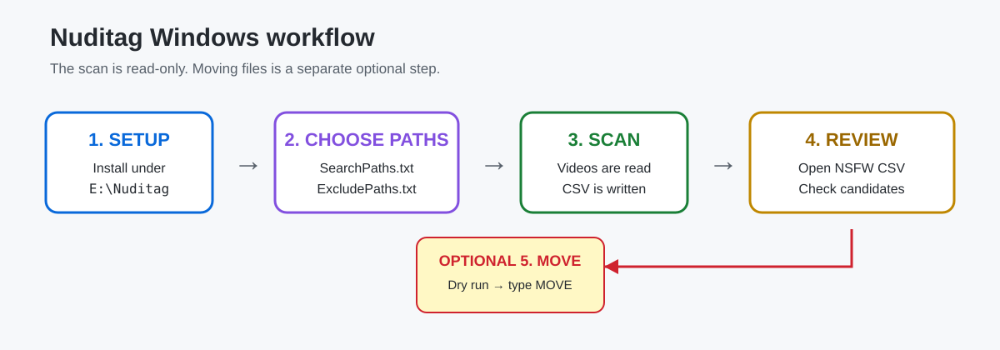
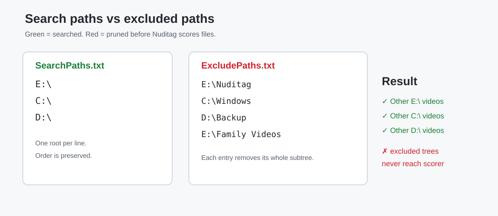
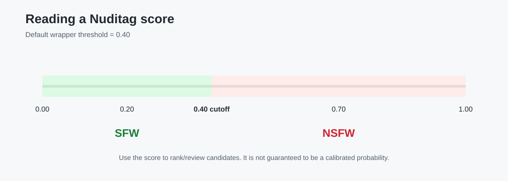
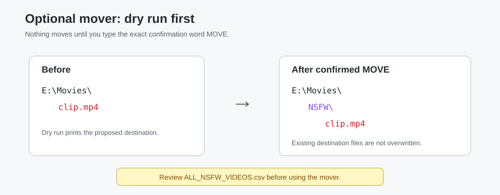

# Nuditag NSFW Video Scanner for Windows

A beginner-friendly Windows wrapper around [ICIJ/Nuditag](https://github.com/ICIJ/nuditag) for finding **potentially NSFW/adult videos on drives or folders you control**.

The package adds the pieces that are convenient for a large Windows library:

- installs Python and Nuditag under E:\Nuditag without requiring Git;
- keeps the Python environment, model cache, working cache, and reports on E:;
- lets you choose **multiple search locations** using SearchPaths.txt;
- completely skips selected directory trees using ExcludePaths.txt;
- scans **videos only**;
- resumes from completed CSV rows after an interruption;
- creates one full CSV plus one easy-to-review NSFW-only CSV;
- can optionally move reviewed flagged videos into an NSFW subfolder;
- performs a **dry run before any move**.

> [!IMPORTANT]
> This is a classification aid, not a perfect detector. False positives and false negatives are possible. Review ALL_NSFW_VIDEOS.csv before moving anything. The score is useful for sorting/review priority; it should not be treated as an exact probability.

## What this project does

The normal Nuditag command scans one directory recursively. This wrapper keeps Nuditag's actual scoring engine but adds a simple include/exclude layer for Windows users.

Suppose SearchPaths.txt contains:

~~~text
E:\
C:\
D:\
~~~

and ExcludePaths.txt contains:

~~~text
E:\Nuditag
C:\Windows
D:\Backup
E:\Family Videos
~~~

The scanner walks the requested drives, but **does not descend into any excluded folder**. Only supported video files that survive that filtering are handed to Nuditag.

## Folder layout after setup

~~~text
E:\Nuditag\
│
├── Python\                       Private Python installation
├── venv\                         Nuditag + Python dependencies
├── ModelCache\                   Downloaded NSFW AI model
├── Cache\                        Runtime cache
├── Temp\                         Temporary working files
├── Reports\
│   ├── ALL_FULL_REPORT.csv
│   ├── ALL_NSFW_VIDEOS.csv
│   └── NSFW_Move_Log_*.csv
│
├── SearchPaths.txt               What to search
├── ExcludePaths.txt              What to skip
├── nuditag_custom_scan.py        Include/exclude scanner helper
├── 02_Run_Custom_Scan.bat        Main scanner launcher
├── 03_Move_NSFW_From_Report.bat  Optional mover
├── Move_NSFW_From_Report.ps1     Safe mover implementation
└── nuditag.bat                   Convenience Nuditag command
~~~

The GitHub folder also contains 01_Setup_Nuditag_On_E.bat, documentation, and diagrams.

## Requirements

- Windows 10 or Windows 11, 64-bit.
- An E: drive with enough free space for Python, dependencies, the AI model, reports, and temporary files.
- Internet access for the first setup and first model download.
- Administrator rights are **not normally required for setup**, because Python is installed privately under E:\Nuditag.
- For a whole C:\ scan, **Run as administrator** is recommended so fewer folders are inaccessible.
- Git is **not required**.

The setup downloads Python 3.12.10 from python.org and installs a pinned Nuditag source revision directly from GitHub as a ZIP.

## Quick start — exactly what to do

### Step 1 — download the tool

Download this repository as ZIP from GitHub and extract it.

Open:

~~~text
mytools\Nuditag-NSFW-Video-Scanner\
~~~

Do **not** run individual files directly from inside the ZIP viewer. Extract the folder first.

### Step 2 — run setup once

Double-click:

~~~text
01_Setup_Nuditag_On_E.bat
~~~

Setup:

1. checks for E:;
2. downloads Python if needed;
3. installs Python under E:\Nuditag\Python;
4. creates E:\Nuditag\venv;
5. installs Nuditag and its dependencies without Git;
6. copies the scanner/mover helper files into E:\Nuditag;
7. preserves existing SearchPaths.txt and ExcludePaths.txt;
8. deletes downloaded installer/temp files after a successful setup.

Some pip steps can sit on one package name for several minutes. That does **not automatically mean the installer is frozen**.

### Step 3 — tell it where to search

Open:

~~~text
E:\Nuditag\SearchPaths.txt
~~~

One path per line:

~~~text
E:\
C:\
D:\
~~~

Or scan only selected folders:

~~~text
E:\Movies
D:\Downloads
C:\Users\YourName\Videos
~~~

Blank lines and lines beginning with # or ; are ignored.

### Step 4 — tell it what not to search

Open:

~~~text
E:\Nuditag\ExcludePaths.txt
~~~

Example:

~~~text
E:\Nuditag
C:\Windows
C:\Program Files
C:\Program Files (x86)
D:\Backup
E:\Family Videos
~~~

If you exclude:

~~~text
E:\Family Videos
~~~

then everything underneath it is skipped too:

~~~text
E:\Family Videos\2024\
E:\Family Videos\2025\
E:\Family Videos\Phone Backup\
~~~

You do not need to list every subfolder.

### Step 5 — run the scan

For a whole-drive scan, right-click:

~~~text
E:\Nuditag\02_Run_Custom_Scan.bat
~~~

and choose:

~~~text
Run as administrator
~~~

The scanner first finds supported video files. Then it prints lines similar to:

~~~text
[1/250] SFW  0.1234  E:\Videos\example.mp4
[2/250] NSFW 0.8123  E:\Videos\another.mkv
~~~

No video is moved or deleted during scanning.

### Step 6 — review the CSV report

Open:

~~~text
E:\Nuditag\Reports\ALL_NSFW_VIDEOS.csv
~~~

This is the smaller report containing only rows at or above your configured threshold.

The complete report is:

~~~text
E:\Nuditag\Reports\ALL_FULL_REPORT.csv
~~~

## SFW, NSFW, score, and threshold

Nuditag produces a score from approximately 0.0 to 1.0.

This wrapper defaults to:

~~~text
THRESHOLD=0.40
~~~

Therefore:

| Score | Label with threshold 0.40 |
|---:|---|
| 0.05 | SFW |
| 0.20 | SFW |
| 0.39 | SFW |
| 0.40 | NSFW |
| 0.65 | NSFW |
| 0.95 | NSFW |

**SFW** means **Safe For Work**.  
**NSFW** means **Not Safe For Work**.

A higher score means the model detected stronger NSFW signals. It is best used as a ranking signal rather than interpreting 0.82 as literally “82% certain.”

To change sensitivity, edit these lines near the top of 02_Run_Custom_Scan.bat:

~~~bat
set "FRAMES=32"
set "THRESHOLD=0.40"
set "WORKERS=0"
~~~

Typical interpretation:

- 0.30 — more sensitive; more possible matches and more false positives.
- 0.40 — practical review-oriented default used by this wrapper.
- 0.60 or 0.70 — stricter; fewer candidates, but greater risk of missing borderline material.

FRAMES=32 asks the wrapper to sample up to 32 positions from a video. Increasing it costs more CPU/time.

## Resume behavior

The scanner writes each successful row immediately.

If you press Ctrl+C, completed rows remain in ALL_FULL_REPORT.csv.

Run 02_Run_Custom_Scan.bat again. Videos whose current path already has a valid score are reused.

The report is also synchronized with your current path rules. If you later exclude a directory, old rows from that now-excluded location are removed from the current report.

### When to force a complete rescan

If you change something that affects the actual score — for example FRAMES=32 to another sampling value — delete or rename:

~~~text
E:\Nuditag\Reports\ALL_FULL_REPORT.csv
E:\Nuditag\Reports\ALL_NSFW_VIDEOS.csv
~~~

before the next run.

Changing only the threshold does **not** require rescoring; existing numeric scores are re-labelled using the new threshold.

## Optional: move reviewed flagged videos

Only do this **after manually reviewing the NSFW report**.

Run:

~~~text
E:\Nuditag\03_Move_NSFW_From_Report.bat
~~~

It first performs a dry run:

~~~text
[DRY RUN] E:\Movies\clip.mp4 -> E:\Movies\NSFW\clip.mp4
~~~

Nothing has moved yet.

The script then requires you to type exactly:

~~~text
MOVE
~~~

before it changes files.

Example result:

~~~text
BEFORE
E:\Movies\
└── clip.mp4

AFTER
E:\Movies\
└── NSFW\
    └── clip.mp4
~~~

The mover:

- does not overwrite an existing destination;
- uses names like clip_1.mp4, clip_2.mp4 when needed;
- skips missing source files;
- skips a video already directly inside a folder named NSFW;
- writes a CSV action log under E:\Nuditag\Reports.

## Supported video types

The exact extension list comes from the installed Nuditag version. Common supported formats include:

~~~text
.avi
.flv
.m4v
.mkv
.mov
.mp4
.mpeg
.mpg
.webm
.wmv
~~~

The helper intentionally ignores image files even though Nuditag itself can also classify images.

## What the scripts do NOT do

They do not:

- upload your videos to this repository;
- upload media to ChatGPT;
- automatically delete videos;
- automatically move anything during scanning;
- bypass Windows file permissions;
- inspect excluded directory trees;
- guarantee perfect adult-content classification.

Nuditag runs the ONNX model locally after the model has been downloaded to the cache.

## Troubleshooting

See [TROUBLESHOOTING.md](TROUBLESHOOTING.md) for installation pauses, permission errors, model download failures, empty reports, resume behavior, and mover messages.

For implementation details, see [TECHNICAL_NOTES.md](TECHNICAL_NOTES.md).

## Third-party software

This project is a wrapper. Nuditag is a separate open-source project maintained by ICIJ. See [THIRD_PARTY.md](THIRD_PARTY.md) for attribution and the exact upstream revision this wrapper is pinned to.

## Safety recommendation

Start with scanning only. Review the report sorted by score from highest to lowest. Use the mover only after you have checked the candidates you care about.

For the first test, put only one small folder in SearchPaths.txt before scanning entire drives.
