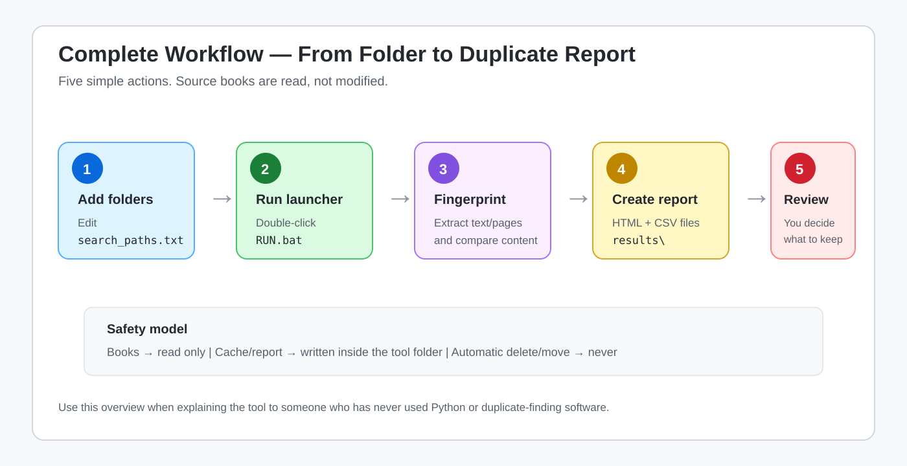
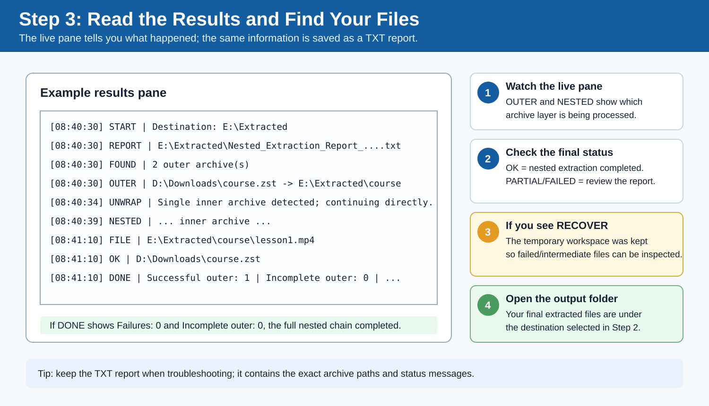
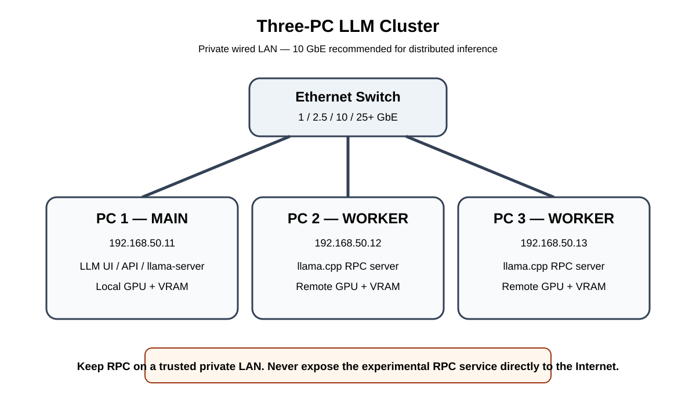

# MyTools Visual Gallery

MyTools keeps independently usable Windows utilities in one repository so they can share safety, documentation, validation, and maintenance standards. This page gives new users a quick visual tour.

## File and media maintenance

### Book Duplicate Finder

Find exact and near-duplicate books/documents across multiple formats, then review likely matches before taking action.

[Open the tool](./Book-Duplicate-Finder/)

### Video Duplicate Finder

Detect re-encoded or near-duplicate videos with perceptual sampling and review candidates in a browser-oriented workflow.

[Open the tool](./Video-Duplicate-Finder/)

### Course Library Manager

Clean course-folder names and create an offline HTML course catalog/player with Cards/Table views, subtitles, progress/resume, resources, and optional thumbnails.

[Open the tool](./Course-Library-Manager/)

### Nuditag NSFW Video Scanner

Run configurable local video scanning, keep resumable reports, and separate review from file organization.

[Open the tool](./Nuditag-NSFW-Video-Scanner/)

### Nested Archive Extractor

Recursively handle archives inside archives, including extensionless inner archives and Zstandard wrappers.

[Open the tool](./Nested-Archive-Extractor/)

### ZIP Bulk Extractor

Extract many ZIP files with simple beginner-friendly launch choices.

[Open the tool](./ZIP-Bulk-Extractor/)

## Windows diagnostics and repair

### Windows PC Performance Recovery

Collect diagnostics, review performance/hardware-health signals, use dry-run-first repairs, and compare before/after results.

[Open the tool](./Windows-PC-Performance-Recovery/)

### USB Port Explorer Pro

Explain USB topology, connected devices, drivers, protocol clues, likely port capability, and practical speed guidance in layman-friendly language.

[Open the tool](./USB-Port-Explorer-Pro/)

### LDPlayer Firebase #303 / Internet Repair

Diagnose common LDPlayer ADB/network/Google-services connectivity problems and walk through recovery checks.

[Open the tool](./LDPlayer-Firebase-303-Repair/)

## Data and local infrastructure

### Telegram Local Downloader for Windows

Download media the signed-in Telegram account can already access and build organized local reports/archives while keeping credentials and session files out of the public repository.

[Open the tool](./Telegram-Local-Downloader-Windows/)

### 3-PC LLM Cluster

Document and validate a small multi-PC setup for distributed/local LLM experiments.

[Open the tool](./3-PC-LLM-Cluster/)

---

For repository-wide safety, contribution, testing, and release practices, see [README.md](./README.md), [SECURITY.md](./SECURITY.md), [TESTING.md](./TESTING.md), and [RELEASING.md](./RELEASING.md).
