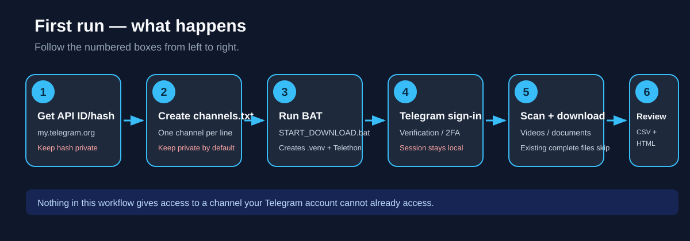
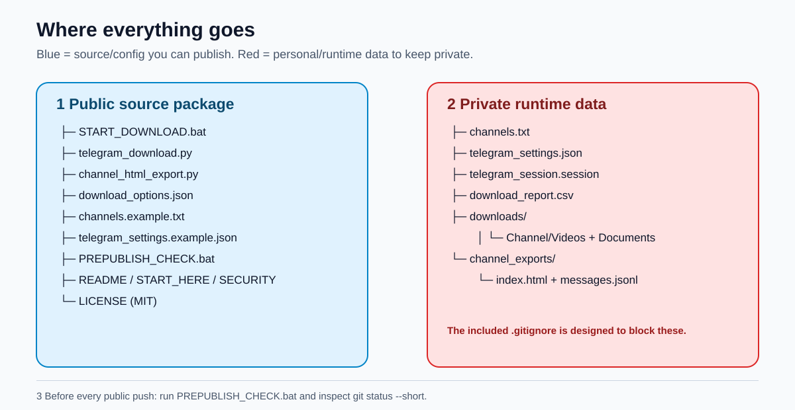
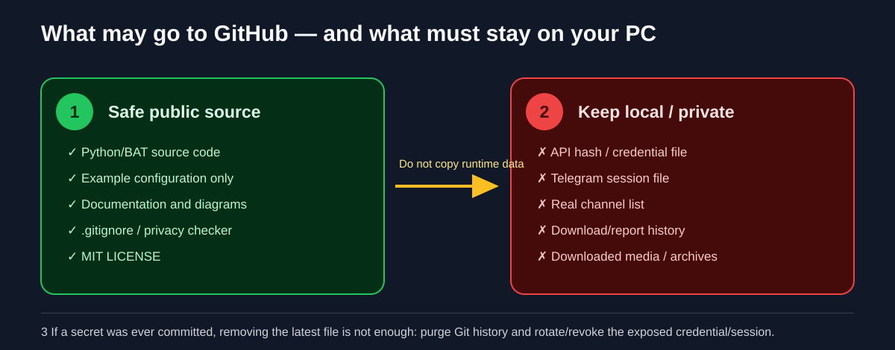

# Telegram Local Downloader for Windows

A beginner-friendly Windows utility for downloading **videos and document files from Telegram channels that your own Telegram account can already access**. It uses [Telethon](https://github.com/LonamiWebs/Telethon), saves files locally, writes a CSV activity report, and can create a searchable offline HTML archive for each scanned channel.

> **Important:** This tool does not bypass Telegram permissions, protected-content controls, private-channel access, or authentication. Use it only for channels and media you are authorized to access and archive.



## What this tool does

- Reads a simple `channels.txt` list.
- Resolves public channel usernames/links or exact titles of channels your account can already access.
- Scans the accessible message history.
- Downloads Telegram **documents** and **videos** to organized local folders.
- Skips files that are already present with the expected size.
- Creates `download_report.csv` so you can review what happened.
- Optionally creates a searchable offline HTML archive under `channel_exports/`.
- Uses up to 1-4 parallel downloads, controlled in `download_options.json`.
- Reuses a local Telegram session after the first successful login.

## What it deliberately does NOT do

- It does **not** auto-join channels.
- It does **not** bypass private-channel access.
- It does **not** bypass protected-content restrictions.
- It does **not** send messages, forward messages, or upload files.
- It does **not** download ordinary Telegram photo messages; this package is focused on videos/documents.
- It does **not** publish your Telegram credentials, session, channel list, downloaded files, or generated reports.

## Requirements

1. Windows 10 or Windows 11.
2. Python 3.10 or newer.
3. A Telegram account.
4. Your own Telegram `api_id` and `api_hash` from Telegram's developer portal.
5. Internet access while installing Telethon and downloading from Telegram.

Python download: <https://www.python.org/downloads/windows/>

Telegram API application page: <https://my.telegram.org/>

## Quick start for non-technical users

### Step 1 - Download the tool

Download this repository as a ZIP or clone it with Git. Open the folder:

```text
Telegram-Local-Downloader-Windows
```

### Step 2 - Install Python if needed

Install Python 3.10+ from python.org. During installation, selecting **Add Python to PATH** is recommended.

You do not need to manually install Telethon. `START_DOWNLOAD.bat` creates a private `.venv` inside this tool folder and installs the required Telegram library there.

### Step 3 - Create your private channel list

Make a copy of:

```text
channels.example.txt
```

Rename the copy to:

```text
channels.txt
```

Put **one channel per line**. Supported examples:

```text
@public_channel_username
https://t.me/public_channel_username
Exact title of a channel already joined
```

Do not upload your real `channels.txt` to a public repository when it reveals private memberships.

### Step 4 - Get your Telegram API ID and API hash

Sign in to <https://my.telegram.org/>, open **API development tools**, create an application if needed, and obtain your own `api_id` and `api_hash`.

Treat the API hash as a secret. Never paste real credentials into GitHub issues, screenshots, README files, or public code.

### Step 5 - Start the downloader

Double-click:

```text
START_DOWNLOAD.bat
```

On the first run the BAT file will:

1. Find Python.
2. Create `.venv` inside this folder.
3. Install Telethon if missing.
4. Try to install optional `cryptg` for faster crypto operations when a compatible wheel exists.
5. Start `telegram_download.py`.

### Step 6 - Enter Telegram credentials and sign in

When prompted, enter your Telegram API ID and API hash. Telethon may then ask for your Telegram login information, verification code, and two-step-verification password if your account uses one.

The public build does **not automatically save your API hash**. If you do not configure credentials privately, it prompts for the API ID/hash when the program starts.

Advanced users may either set the `TG_API_ID` and `TG_API_HASH` environment variables or manually copy `telegram_settings.example.json` to `telegram_settings.json` and fill in their own values. The real settings file is Git-ignored and must remain private.

The authenticated Telegram session is stored locally as `telegram_session.session`. Treat this session file like a credential.

### Step 7 - Let the scan finish

The program scans the accessible channel history, identifies downloadable videos/documents, then downloads missing files. You can safely run it again later; complete existing files are skipped.

### Step 8 - Review the results

Your output is organized under the tool folder:

```text
downloads/
  Channel Name/
    Videos/
    Documents/

download_report.csv
channel_exports/
  Channel Name/
    index.html
    messages.jsonl
```

Open a channel's `index.html` in your browser to search its locally indexed messages/captions and open files that were downloaded.



## Configuration

Edit `download_options.json`:

```json
{
  "parallel_downloads": 3,
  "export_html": true
}
```

### `parallel_downloads`

Allowed range: **1 to 4**.

- `1` = lightest load and easiest to troubleshoot.
- `2-3` = reasonable default for most systems/connections.
- `4` = maximum supported by this package.

A higher value does not guarantee a faster result. Telegram limits, disk speed, file size, network quality, and CPU crypto performance can all affect throughput.

### `export_html`

- `true` = create/update the local searchable channel archive.
- `false` = download media and CSV report only.

## Understanding the files

| File/folder | Purpose | Public GitHub safe? |
|---|---|---|
| `START_DOWNLOAD.bat` | Beginner-friendly launcher and environment setup | Yes |
| `telegram_download.py` | Main Telegram scan/download engine | Yes |
| `channel_html_export.py` | Builds the offline searchable HTML archive | Yes |
| `download_options.json` | Non-secret speed/export options | Yes |
| `channels.example.txt` | Placeholder/example channel list | Yes |
| `telegram_settings.example.json` | Placeholder credential format | Yes |
| `requirements.txt` | Python dependency versions/ranges | Yes |
| `.gitignore` | Prevents common private/runtime files being committed | Yes |
| `prepublish_check.py` | Scans the source tree for common accidental private data | Yes |
| `PREPUBLISH_CHECK.bat` | Runs the privacy scan on Windows | Yes |
| `channels.txt` | Your real channel targets | **No by default** |
| `telegram_settings.json` | Your real Telegram API credentials | **Never publish** |
| `telegram_session.session` | Authenticated Telegram session | **Never publish** |
| `download_report.csv` | Local download/channel/message history | **Private by default** |
| `downloads/` | Downloaded user/channel media | **Do not publish automatically** |
| `channel_exports/` | Message text/captions and local archive metadata | **Private by default** |



## How duplicate/re-run handling works

Each downloadable file is given a local name containing its Telegram message ID. Before downloading, the program checks whether a local file already exists and, when Telegram provides a size, whether its size matches the expected size. Complete files are skipped. Incomplete/failed downloads can be retried by running the tool again.

This is **not** a byte-level resume system: a partial file is restarted rather than continuing from the last byte.

## Offline HTML archive

When HTML export is enabled, each channel gets:

- `index.html` - browser-friendly searchable page.
- `messages.jsonl` - one JSON record per scanned message.

The HTML page can filter/search messages and provides links to locally downloaded files. Message text, filenames, and channel titles are HTML-escaped before rendering, and the page uses a restrictive Content Security Policy.

The archive can still contain sensitive data such as captions, message IDs, filenames, channel IDs, and private-channel links. Keep generated archives private unless you intentionally sanitize them.

## Privacy and security protections included

This public package was sanitized specifically for GitHub sharing. It includes safeguards such as:

- No real Telegram API credentials in the repository.
- No authenticated Telegram session.
- No real channel list.
- No historic download report.
- No downloaded media or generated channel archives.
- `.gitignore` rules for credentials, sessions, private inputs, outputs, caches, and environments.
- CSV formula-injection neutralization for Telegram-controlled text written to reports.
- HTML escaping and a restrictive Content Security Policy in generated archives.
- Relative archive paths rather than personal Windows profile paths.
- A pre-publication privacy scanner.

Before pushing your own changes, double-click:

```text
PREPUBLISH_CHECK.bat
```

You should see:

```text
PRE-PUBLISH CHECK PASSED
```

Also run:

```bat
git status --short
```

and inspect everything that is about to be committed.

## Environment-variable alternative for credentials

Advanced users can avoid `telegram_settings.json` and provide:

```text
TG_API_ID
TG_API_HASH
```

as environment variables. The downloader checks those before asking interactively.

## Common problems

### "Python not found"

Install Python 3.10+ and reopen Command Prompt. Test:

```bat
python --version
```

or:

```bat
py --version
```

### "Edit channels.txt and run again"

Create `channels.txt` from `channels.example.txt` and replace the placeholder with at least one real channel your account can access.

### "Cannot resolve ..."

Try one of these forms:

1. `@public_username`
2. `https://t.me/public_username`
3. Exact title as shown in your Telegram dialog list
4. Exact title as shown in your Telegram dialog list

Invite links are intentionally not used for automatic joining.

### Telegram asks me to wait

Telegram can return a `FloodWait` when requests are made too quickly. The program handles Telegram's wait instruction; leave it running rather than repeatedly restarting it.

### A file is not downloaded

The current downloader intentionally focuses on Telegram document/video media. Ordinary photo-only messages are not downloaded.

### HTML opens but a local file link does not

The local file may not have completed successfully, may have been moved, or its size may not match Telegram's expected size. Re-run the downloader or check `download_report.csv`.

More details: [START_HERE.md](START_HERE.md) and [TROUBLESHOOTING.md](TROUBLESHOOTING.md).

## Safety notes for public GitHub use

Never force-add ignored files simply to make Git accept them. If a credential or session file was ever committed, deleting it in a later commit does **not** erase the secret from Git history. Purge the old history and rotate/revoke the exposed credential/session as appropriate.

See [SECURITY.md](SECURITY.md) for the full privacy checklist.

## Project structure

```text
Telegram-Local-Downloader-Windows/
├─ README.md
├─ START_HERE.md
├─ TROUBLESHOOTING.md
├─ SECURITY.md
├─ LICENSE
├─ .gitignore
├─ START_DOWNLOAD.bat
├─ PREPUBLISH_CHECK.bat
├─ telegram_download.py
├─ telegram_config.py
├─ telegram_media.py
├─ telegram_progress.py
├─ channel_html_export.py
├─ prepublish_check.py
├─ download_options.json
├─ channels.example.txt
├─ telegram_settings.example.json
├─ requirements.txt
└─ docs/
   └─ images/
      ├─ 01-first-run-workflow.svg
      ├─ 02-folder-output-map.svg
      └─ 03-private-vs-public.svg
```

## License

This tool is released under the **MIT License**. See [LICENSE](LICENSE).

In simple terms, the MIT License allows people to use, copy, modify, distribute, sublicense, and sell copies of the software, including in commercial projects, provided the copyright and MIT license notice are retained. The software is provided without warranty.

Third-party dependencies such as Telethon remain under their own licenses.
