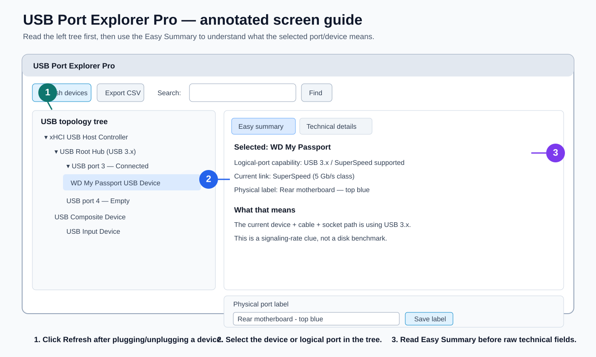
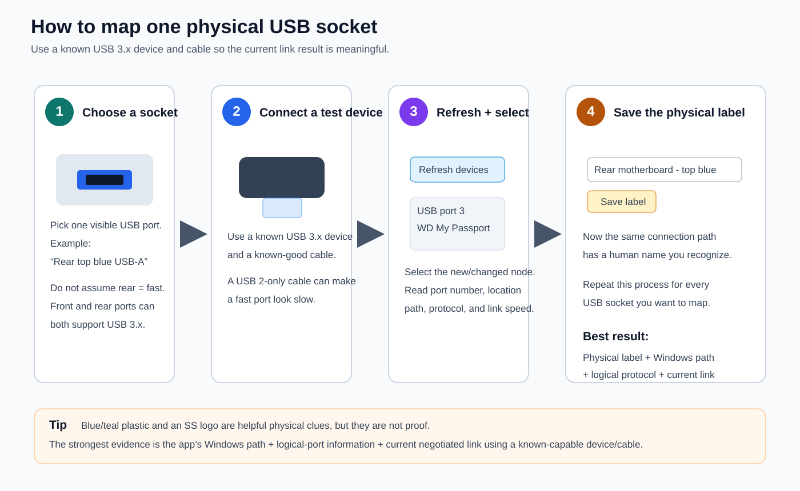
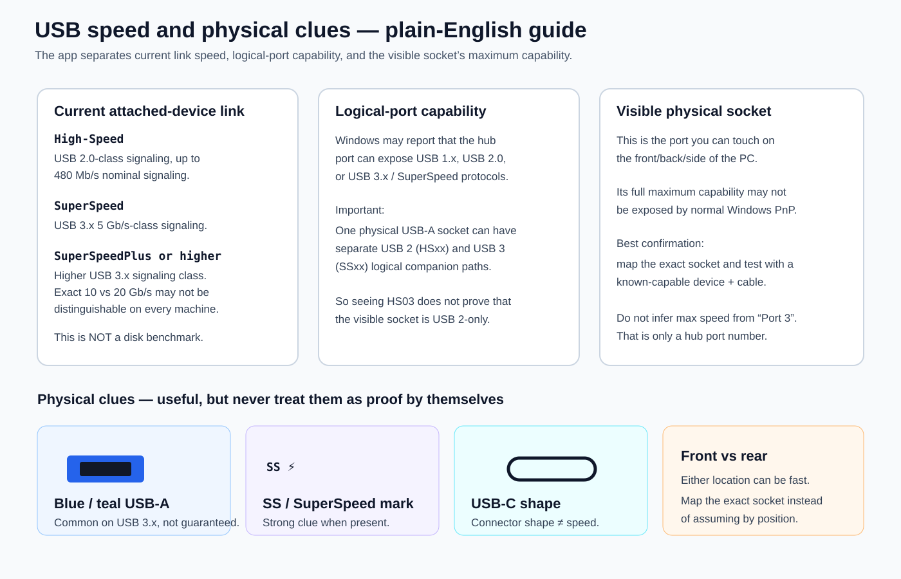

# USB Port Explorer Pro

A beginner-friendly Windows USB topology viewer inspired by the type of information shown by tools such as USBTreeView, with an additional **Easy Summary** that explains ports and connection information in plain English.

The program combines normal Windows Plug-and-Play information with read-only Windows USB hub queries. It can show controllers, hubs, connected USB devices, logical hub ports, Windows location paths, driver information, storage details, current driver-reported link-speed clues, and your own saved labels for physical sockets.

> **Safety:** this tool is read-only. It does not install drivers, change the registry, modify USB power settings, format disks, or write to files on connected USB devices.

## What it is useful for

Use it when you want to answer questions such as:

- Which USB controller or hub is this device connected through?
- Which Windows logical port does a physical socket map to?
- Is a device currently operating at USB 2.0 High-Speed or USB 3.x SuperSpeed?
- Does the logical hub port report USB 3.x/SuperSpeed support?
- Which physical socket did I label as `Rear top blue`, `Front right`, or `USB-C left`?
- Which USB storage device maps to `PhysicalDrive1` and what is its size/model?
- What driver, hardware IDs, parent device, location path, install date, and arrival date does Windows report?

## Quick start

### Requirements

- Windows 10 or Windows 11
- Windows PowerShell 5.1 or newer
- .NET Framework components already present on normal Windows 10/11 installations
- No Python installation
- No third-party PowerShell modules
- No custom USB driver

### Run it

1. Download the **whole `USB-Port-Explorer-Pro` folder**.
2. Keep the folder structure intact. The required runtime items are:
   - `USB_Port_Explorer.ps1`
   - `USB_Hub_Probe.cs`
   - `Run_USB_Port_Explorer.bat`
   - the complete `src/` folder
3. Double-click `Run_USB_Port_Explorer.bat`.

Do not run the individual files under `src/` directly. `USB_Port_Explorer.ps1` is the small wrapper that loads those source modules in the correct order.
4. Select a controller, hub, logical port, or device in the tree.
5. Read **Easy Summary** first.
6. Open **Technical Details** when you need raw Windows information.

The program creates a `USB_Port_Explorer_Reports` folder beside the script when you export a CSV or save physical-port labels.

## Visual step-by-step guide

### Step 1 — Understand the main screen



1. **Refresh devices** after plugging in or unplugging a USB device.
2. Select the relevant controller, hub, logical port, or connected device in the **USB topology tree**.
3. Read **Easy Summary** first. It explains the selected item in plain English.
4. Use **Technical Details** only when you need PnP IDs, drivers, location paths, protocol flags, or other diagnostic fields.
5. Give verified connection paths a human-friendly name such as `Rear top blue`, `Front right`, or `USB-C left`.

### Step 2 — Map a physical USB socket



The safest workflow is to connect a known USB 3.x device with a known-good cable, refresh the tree, select the changed device/port, read the reported information, and then save a physical label. Repeat this for each socket you want to identify.

### Step 3 — Interpret speed and physical clues correctly



Remember that **current link speed**, **logical-port capability**, and the **maximum capability of the visible physical socket** are different things. Blue/teal plastic and an `SS`/SuperSpeed mark are useful visual clues, but neither should be treated as proof by itself.

> **Screenshot note:** Windows themes, display scaling, and future versions can make the exact GUI look slightly different. The numbered workflow remains the same.

## Understanding the screen

| Area | What it means |
|---|---|
| USB tree | Controllers, hubs, logical ports, devices, and interfaces discovered from Windows |
| Easy Summary | Plain-English interpretation of the selected item |
| Technical Details | PnP IDs, location paths, driver metadata, native hub query results, storage mapping, and other diagnostic information |
| Refresh devices | Re-scan the present USB topology and native hub information |
| Export CSV | Save the current inventory to a timestamped CSV file |
| Search | Find nodes by name, IDs, port number, location path, manufacturer, and related fields |
| Physical port label | Save a human label such as `Rear top blue` for the selected connection path |

## USB speed: the three values people often mix up

The application deliberately keeps these concepts separate.

### 1. Current attached-device link speed

This is the USB signaling mode Windows reports for the **device/path currently in use**.

Examples:

- Low-Speed — 1.5 Mb/s signaling
- Full-Speed — 12 Mb/s signaling
- High-Speed — 480 Mb/s signaling, normally USB 2.0
- SuperSpeed — 5 Gb/s class, USB 3.x
- SuperSpeedPlus or higher — USB 3.x higher-speed signaling, but this version does not reliably distinguish every 10/20 Gb/s generation

This is **not a disk benchmark**. A 5 Gb/s link does not mean a hard drive will copy files at 5 Gb/s.

### 2. Logical-port protocol support

Windows may report that the logical hub port exposes USB 1.x, USB 2.0, or USB 3.x/SuperSpeed protocols.

A physical USB-A socket can have companion USB 2 and USB 3 paths, so a USB 2 device can appear on a High-Speed path even though the same visible socket also supports SuperSpeed.

### 3. Maximum capability of the visible physical socket

This is what people usually mean by “Is this a USB 3.0 / 3.2 / USB4 port?”

Windows does not always expose enough information to prove the absolute marketing maximum of every visible socket. Motherboard wiring, front-panel headers, internal hubs, adapters, cables, BIOS/firmware, and the attached device can all matter.

The most practical confirmation is to map the physical socket and test it with a known-capable device and cable.

## How to identify a physical port

A reliable workflow is:

1. Choose one visible USB socket on the PC.
2. Connect a known USB 3.x device with a known-good USB 3.x cable.
3. Click **Refresh devices**.
4. Find the newly connected device.
5. Note its Windows port/location path and the Easy Summary.
6. Save a physical label such as:
   - `Rear motherboard - top blue`
   - `Rear motherboard - lower USB-C`
   - `Front panel - left`
   - `Front panel - right SS`
7. Repeat for the remaining sockets.

Once labeled, the application can reuse those connection-path labels on later scans.

## Visual clues a non-technical user can check

These clues are useful, but they are **not proof by themselves**.

### Blue or teal plastic inside a USB-A socket

Blue/teal is commonly used for USB 3.x USB-A ports. However, color is a manufacturer convention, not a guarantee. Some fast ports are black, red, yellow, or another color.

### `SS` / SuperSpeed logo

An `SS` or SuperSpeed marking near the socket is a strong clue that the port was intended for USB 3.x. Some systems do not print the logo even when the port supports SuperSpeed.

### USB-C shape

USB-C describes the **connector shape**, not the speed. A USB-C socket may support USB 2.0, USB 3.x, USB4, charging, display output, or some combination of them.

### Front versus rear ports

Rear motherboard ports and front case ports can both be USB 3.x or faster. Do not assume “rear = fast” or “front = slow.” Front-panel speed depends on the case wiring and motherboard header.

## Example interpretation

If the Easy Summary says something similar to:

```text
Logical-port capability: USB 3.x / SuperSpeed supported
Current attached-device link: SuperSpeed (5 Gb/s class)
```

then the current **device + cable + socket path** is successfully using USB 3.x SuperSpeed.

If it instead says:

```text
Logical-port capability: USB 3.x / SuperSpeed supported
Current attached-device link: High-Speed (480 Mb/s)
```

then the logical port can expose USB 3.x, but the current connection is running at USB 2.0 High-Speed. Possible reasons include the device itself, the cable, an adapter/hub, or the companion path being used.

## What information can be shown

Depending on the hardware and Windows drivers, the program can display:

- Friendly name and Windows device description
- USB/PnP instance ID
- Parent PnP ID
- Windows port number
- Port location and location path
- Controller, root hub, external hub, interface, and storage nodes
- Hardware IDs and compatible IDs
- Manufacturer
- Device class and class GUID
- Driver service, provider, version, date, INF path, and driver key
- Enumerator and device address
- Install / first-install / last-arrival dates when exposed
- Logical USB port connection state
- Logical-port protocol flags from the Windows USB hub driver
- Current attached-device signaling-speed clue from the Windows USB stack
- PhysicalDrive mapping, storage model, serial, and capacity where a match is possible
- Saved user-friendly physical socket label

Not every Windows driver exposes every property, so blank or unavailable fields are normal.

## Files in this folder

| File | Purpose |
|---|---|
| `USB_Port_Explorer.ps1` | Small main wrapper. It validates and loads the annotated PowerShell source modules from `src/` in the required order. |
| `src/USB_Port_Explorer_Part*.ps1` | Main PowerShell implementation: PnP inventory, topology, storage mapping, Easy Summary, GUI, search, physical labels, CSV export, and event handling. Split into readable modules so the code is easier to review and maintain. |
| `USB_Hub_Probe.cs` | Read-only native Windows USB hub / port queries used for protocol and link-speed clues. |
| `Run_USB_Port_Explorer.bat` | Beginner-friendly double-click launcher. |
| `TECHNICAL_NOTES.md` | Architecture, Windows APIs, terminology, and implementation details |
| `TROUBLESHOOTING.md` | Common problems and what to try |
| `CHANGELOG.md` | Version history |

### Why the PowerShell source is split

The original application grew large enough that a single PowerShell file became difficult to review. The public repository keeps the implementation in sequential, clearly named files under `src/`.

This is only a source-code organization change. The user still launches `Run_USB_Port_Explorer.bat` (or `USB_Port_Explorer.ps1`); the wrapper loads every module automatically. Keeping the modules separate also makes it easier for a beginner to see which section handles discovery, interpretation, exports, and the GUI.

## Reports and saved labels

The application creates:

```text
USB_Port_Explorer_Reports\
```

Typical contents include:

```text
Physical_Port_Labels.json
USB_Inventory_YYYYMMDD_HHMMSS.csv
```

`Physical_Port_Labels.json` stores only the names you assign to connection paths. Deleting it resets your saved labels.

## Permissions and privacy

The viewer reads local Windows hardware metadata. It does not send the inventory anywhere.

Some USB hub interfaces may refuse a query depending on the driver, permissions, or hardware implementation. The program falls back to normal PnP data when a native hub query is unavailable.

## Limitations

- It is not a throughput benchmark.
- It cannot guarantee the marketing maximum speed of every visible connector.
- USB-A versus USB-C is not reliably available from normal PnP properties for every system.
- USB Power Delivery, charging wattage, DisplayPort Alternate Mode, and Thunderbolt capabilities are not comprehensively detected.
- A USB 3.x-capable physical socket can still show a USB 2.0 path when a USB 2.0 device is attached.
- “SuperSpeedPlus or higher” does not currently provide a reliable 10-versus-20-Gb/s distinction on every machine.
- Storage matching is best-effort because Windows exposes USB device and disk nodes separately.
- Hardware/driver behavior varies, so testing on multiple Windows PCs is recommended before relying on a field for automated decisions.

## Troubleshooting

See [TROUBLESHOOTING.md](./TROUBLESHOOTING.md).

## Technical details

See [TECHNICAL_NOTES.md](./TECHNICAL_NOTES.md).
