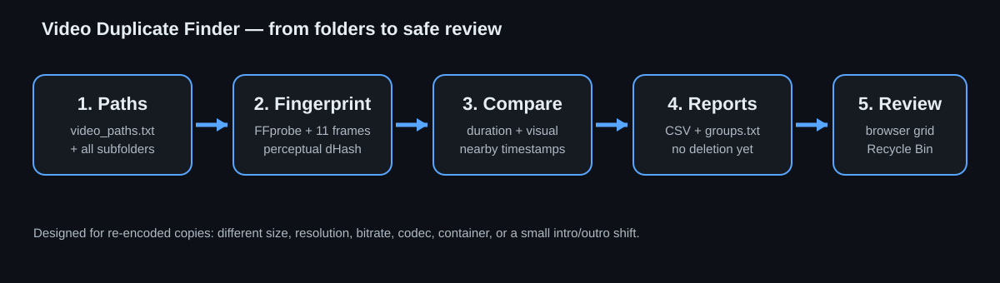
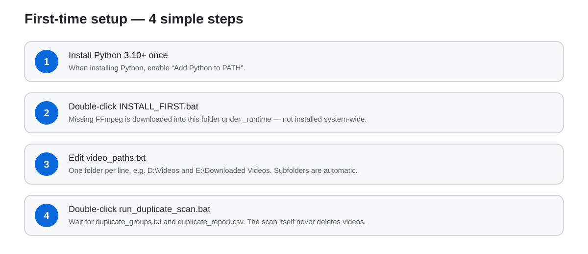
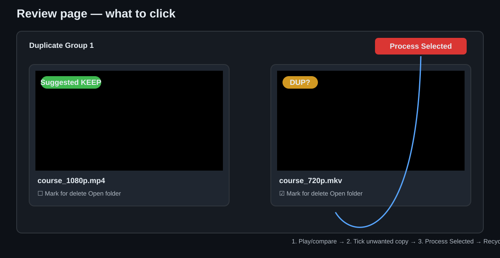

# Video Duplicate Finder

A beginner-friendly Windows tool for finding videos that contain the **same or almost the same visual content** even when their file size, resolution, bitrate, filename, codec, or container is different.

It also includes a local browser review page so you can play duplicate candidates side by side, mark unwanted copies, and move the selected files to the **Windows Recycle Bin**.



## What problem does it solve?

Normal duplicate finders often use MD5/SHA hashes. That works only when two files are byte-for-byte identical. A re-encoded 720p copy and a 1080p copy of the same video will have completely different normal hashes.

This tool instead uses sampled **perceptual frame hashes** plus duration checks. It is designed for cases such as:

| Copy A | Copy B | Can this tool still compare them? |
|---|---|---|
| `video.mp4`, 1.5 GB, 1080p | `video.mkv`, 420 MB, 720p | Yes |
| H.264 | H.265 | Yes |
| 20:04 duration | 20:01 duration | Yes, within configured tolerance |
| Same content with a small intro shift | Same content without that intro | Often yes, using nearby timestamp refinement |
| Completely different videos | Different content | Usually filtered out |

> [!IMPORTANT]
> Detection is a **review aid**, not an automatic deletion decision. Always review candidates before removing files.

## Included files

| File | Plain-English purpose |
|---|---|
| `INSTALL_FIRST.bat` | Checks Python and runs the portable FFmpeg installer. |
| `setup_prerequisites.py` | Downloads/extracts FFmpeg into this tool folder if needed. |
| `video_paths.txt` | The folders you want scanned. One path per line. |
| `run_duplicate_scan.bat` | Starts the duplicate scan. |
| `find_duplicate_videos.py` | Main scanner/orchestrator. |
| `vdf_core.py` | FFmpeg discovery, probing, frame hashing, and fingerprint cache. |
| `vdf_match.py` | Similarity scoring, duplicate grouping, and report writing. |
| `run_duplicate_review.bat` | Opens the local browser review app. |
| `review_duplicates.py` | Local HTTP server and review/delete actions. |
| `review_ui.py` | Browser grid HTML/CSS/JavaScript. |
| `review_data.py` | Report parsing, file-size display, deletion log, and Recycle Bin helper. |
| `report_path.txt` | Optional pointer when `duplicate_groups.txt` is stored elsewhere. |
| `TECHNICAL_NOTES.md` | More detail about the algorithm and limitations. |

## Requirements

- Windows 10 or Windows 11.
- Python **3.10 or newer**.
- Internet access only for the first portable FFmpeg download if FFmpeg is not already available.
- No third-party Python packages are required.

FFmpeg/FFprobe are either taken from the normal Windows `PATH` or installed locally under:

```text
_runtime\ffmpeg\
```

Nothing needs to be added permanently to the Windows PATH for the portable copy.

## Step-by-step setup



### Step 1 — Download this folder

Download or clone this repository, then open the `Video-Duplicate-Finder` folder.

### Step 2 — Run `INSTALL_FIRST.bat`

Double-click:

```text
INSTALL_FIRST.bat
```

It uses your existing Python installation. If FFmpeg/FFprobe are missing, `setup_prerequisites.py` downloads a portable copy into `_runtime`.

If Python is missing, install Python 3.10+ from python.org and enable **Add Python to PATH**, then run `INSTALL_FIRST.bat` again.

### Step 3 — Edit `video_paths.txt`

Put one folder on each line:

```text
D:\Videos
E:\Downloaded Videos
F:\Old Courses
```

Subfolders are scanned automatically. Lines beginning with `#` are comments.

### Step 4 — Run the scan

Double-click:

```text
run_duplicate_scan.bat
```

The first scan may take time because the tool must fingerprint every usable video. Later runs reuse `video_fingerprint_cache.json` for files that have not changed.

### Step 5 — Review the reports

The scan creates:

- `duplicate_groups.txt` — easiest human-readable grouping.
- `duplicate_report.csv` — detailed pair-by-pair scores, suitable for Excel.
- `video_fingerprint_cache.json` — cache used by future scans.

Example group:

```text
GROUP 3 - 2 files
Suggested keeper: D:\Videos\course_1080p.mp4

[KEEP] D:\Videos\course_1080p.mp4
[DUP?] E:\Archive\course_720p.mkv
```

`KEEP` and `DUP?` are suggestions only.

## Review candidates visually



After the scan, double-click:

```text
run_duplicate_review.bat
```

The tool starts a local-only page such as:

```text
http://127.0.0.1:8765/
```

Keep the command window open while using the page.

The page shows each duplicate group in a grid. You can:

- play videos directly when your browser supports the codec;
- see the filename, folder, size, and suggested keeper;
- click **Open folder** for files that do not play in the browser;
- tick **Mark for delete**;
- use **Mark DUP? files** for a quick starting selection;
- click **Process Selected** to move checked files to the Windows Recycle Bin.

### Deletion guard rails

The review app deliberately adds safeguards:

1. Files go to the **Recycle Bin**, not permanent deletion.
2. It blocks a request that would remove **every remaining file in one group**.
3. Selecting a **Suggested KEEP** file triggers an extra confirmation.
4. Every attempted deletion is recorded in `deleted_files_log.csv`.

## How matching works in simple terms

The scanner does this:

```text
Video folders
    ↓
Read duration/resolution with FFprobe
    ↓
Skip obviously incompatible candidates
    ↓
Take 11 sample frames across each video
    ↓
Create small perceptual hashes
    ↓
Compare likely pairs
    ↓
Recheck nearby ±10-second timestamps when promising
    ↓
Create CSV + duplicate groups
```

The default sample points are 5%, 10%, 20%, 30%, 40%, 50%, 60%, 70%, 80%, 90%, and 95% of the video.

## Understanding the CSV

| Column | Meaning |
|---|---|
| `classification` | `ALMOST CERTAIN`, `VERY LIKELY`, or `POSSIBLE` duplicate. |
| `score` | Convenience score combining visual, duration, and hash-distance information. |
| `visual_match_ratio` | Fraction of successfully compared samples that matched the threshold. |
| `matched_samples` | Number of matching sampled positions. |
| `compared_samples` | Number of usable sampled positions. |
| `avg_hash_distance` | Lower generally means the visual samples were closer. |
| `duration_diff_seconds` | Difference between video durations. |
| `video_a`, `video_b` | Full paths of the compared files. |

For manual review, start with **ALMOST CERTAIN DUPLICATE**, then **VERY LIKELY DUPLICATE**, then the possible matches.

## Tuning

Advanced users can edit the constants near the top of `find_duplicate_videos.py`:

```python
DURATION_TOLERANCE_PERCENT = 5.0
DURATION_TOLERANCE_SECONDS = 15.0
MAX_FRAME_HASH_DISTANCE = 10
MIN_MATCHED_SAMPLE_RATIO = 0.72
```

Making the thresholds stricter usually reduces false positives but may miss more edited copies.

## Troubleshooting

### `ERROR: Missing: ffmpeg, ffprobe`

Run `INSTALL_FIRST.bat`. The scanner checks both normal Windows PATH and the local `_runtime\ffmpeg` tree.

### FFmpeg download fails or hangs

Open `install_log.txt`. Also verify that Python can reach `https://www.gyan.dev/`. A corporate proxy, antivirus web filter, or firewall can block downloads.

### A video does not play in the browser

That does **not** necessarily mean the video is damaged. Browsers do not support every MKV/HEVC/AVI combination. Click **Open folder** and use VLC/MPC-HC/your normal media player.

### A file appears as missing

The file may have been moved/deleted after the scan. Run the duplicate scan again to refresh the report.

### The same files are rescanned every time

The cache reuses a fingerprint only when the full path, size, and modification time still match. Moving or modifying the file requires a new fingerprint.

## Privacy and safety

- Video content is processed locally by FFmpeg.
- The review web server binds to `127.0.0.1`, not your LAN interface.
- No video is uploaded by this tool.
- The scanner itself never deletes or moves videos.
- The review app only changes files after you select them and confirm.

## Known limitations

- It is visual-content based; this release does **not** implement audio fingerprinting.
- Heavy crops, mirroring, large overlays, speed changes, or major edits can reduce matching accuracy.
- Duplicate groups are transitive: if A matches B and B matches C, they can be grouped together. Check `duplicate_report.csv` for exact pair scores.
- The suggested keeper is based mainly on resolution, duration, and size, not a full quality analysis.

## Generated files that are intentionally not committed

The `.gitignore` excludes:

```text
_runtime/
video_fingerprint_cache.json
duplicate_report.csv
duplicate_groups.txt
deleted_files_log.csv
install_log.txt
```

This keeps your local paths, reports, and runtime binaries out of GitHub.

## License / reuse

This folder does not add a separate license. It follows whatever license/usage terms are applied at the repository level.
