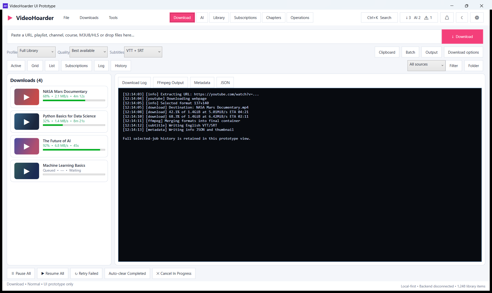
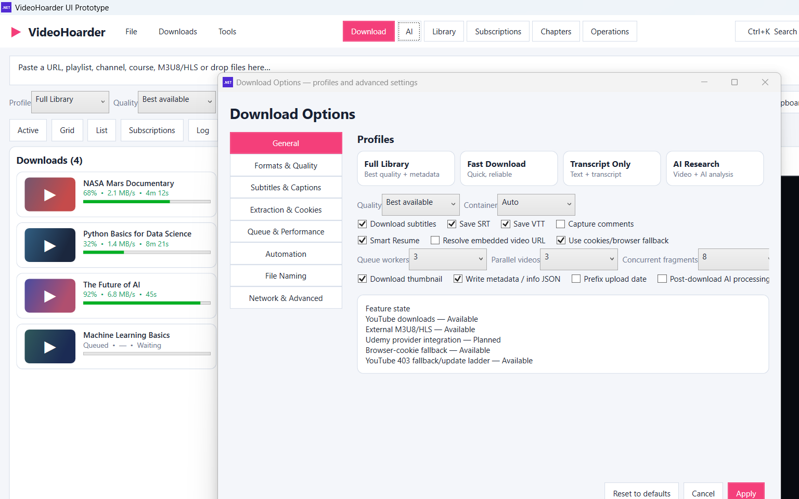
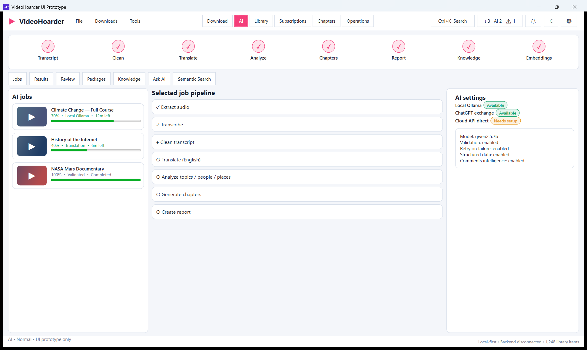
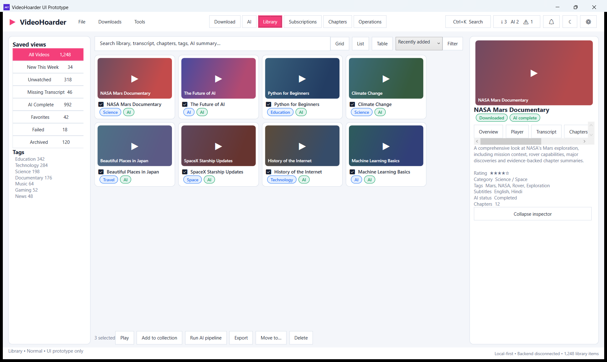
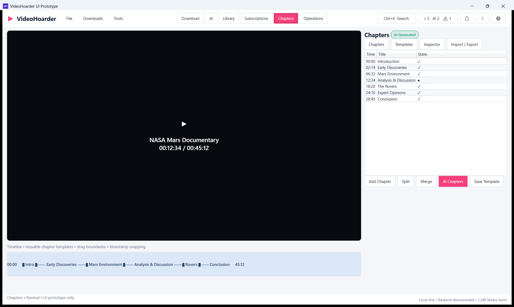
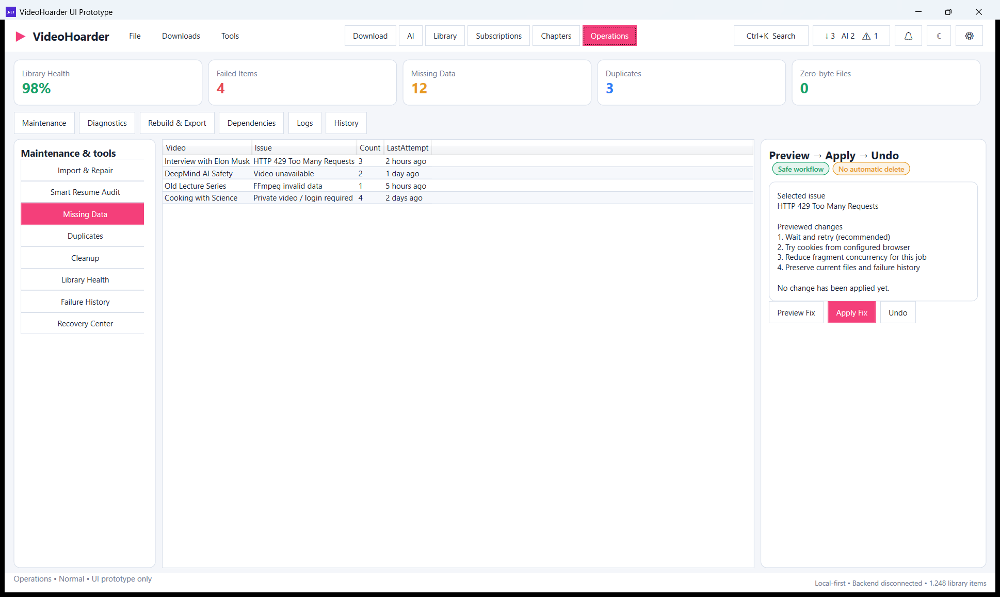

# VideoHoarder WPF UI Prototype

A standalone, **UI-only** WPF prototype for the next VideoHoarder desktop interface.

This prototype deliberately does **not** connect to the current VideoHoarder database, yt-dlp jobs, Python backend, files, subscriptions, or AI services. It exists to lock down the interaction model and visual structure before backend integration.

## Final navigation

**Download | AI | Library | Subscriptions | Chapters | Operations**

The design keeps permanent chrome small and gives the active mode almost the entire window. Options open only when requested, following the Stacher-inspired workflow the design is based on.

## What is implemented in the prototype

- Stacher-style Download workspace with URL input, profiles, quality, subtitles, Active/Grid/List/Subscriptions/Log/History views, compact job list and large live console
- Download profiles: Full Library, Fast Download, Transcript Only, AI Research, Media Only and Audio Only
- Download Options dialog with formats, subtitles, cookies/extraction, concurrency, automation, naming, network/advanced sections
- AI pipeline: Transcript → Clean → Translate → Analyze → Chapters → Report → Knowledge → Embeddings
- AI tabs for Jobs, Results, Review, Packages, Knowledge, Ask AI and Semantic Search
- Library saved views, grid/list/table controls, bulk actions and collapsible video inspector with Overview/Player/Transcript/Chapters/AI/Files/History
- Subscription provider state: YouTube available; Udemy and RSS/Web visibly marked planned
- Chapters editor with player area, chapter table, split/merge, AI chapters, reusable templates and timeline
- Operations mode for repair, Smart Resume audit, missing data, duplicates, cleanup, library health, failures, recovery, diagnostics, dependencies, logs, history and rebuild/export
- Global Activity drawer
- Notification center
- Ctrl+K command palette
- Unified cross-mode history
- Portable tools/dependency status
- Preview → Apply → Undo pattern for risky operations
- Drag/drop and clipboard/batch intake
- Keyboard shortcuts
- Light/dark theme switch
- First Run / Empty / Loading / Offline preview states
- Feature-state badges: Available / Experimental / Planned / Needs setup
- Extended-selection tables for bulk actions

## Portability

The prototype resolves its tool paths relative to its own folder.

Local runtime/tool installation belongs under:

`tools\dotnet`
`tools\nuget-cache`
`tools\dotnet-home`
`tools\temp`

No global .NET installation is required when the portable tool setup is used.

The large local .NET SDK binaries are intentionally **not committed to GitHub**. Run `Setup-Portable-Tools.cmd` once after cloning; it installs the SDK under this prototype's own `tools` directory.

## Run

```bat
Setup-Portable-Tools.cmd
Build-Prototype.cmd
Run-Prototype.cmd
```

## Screenshots

### Download mode — active queue + full log


### Download options + profiles


### AI mode


### Library mode


### Subscriptions mode


### Chapters mode


### Operations mode


See [docs/VIDEOHOARDER_UI_PROTOTYPE_DESIGN.md](docs/VIDEOHOARDER_UI_PROTOTYPE_DESIGN.md) for the complete design/feature map.

## Build verification

Latest local verification on 2026-10-02:

- .NET SDK: 10.0.401 (portable)
- Target: net10.0-windows / WPF
- Build: **Succeeded**
- Warnings: **0**
- Errors: **0**

## Scope boundary

This repository folder is the **design prototype**, not a replacement for the production VideoHoarder backend. The production migration plan remains:

**C# WPF + MVVM UI → local IPC/API → modular Python processing engine → SQLite → existing yt-dlp/FFmpeg/AI/report workflows.**
