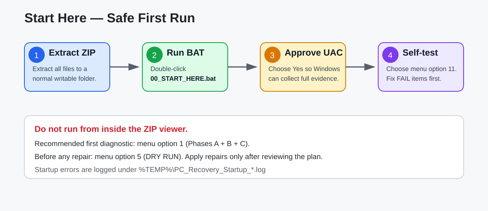
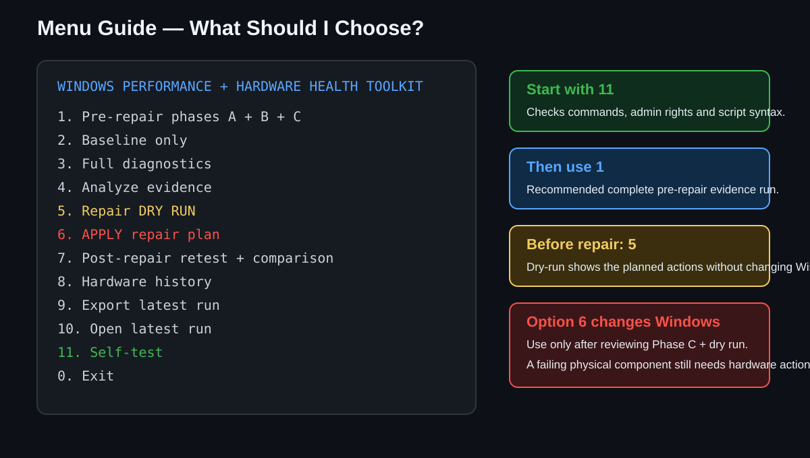
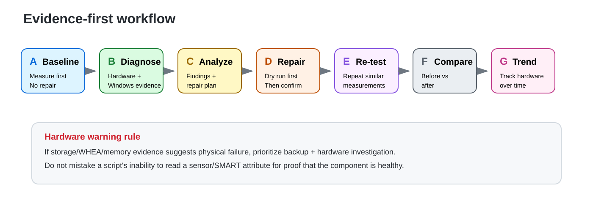
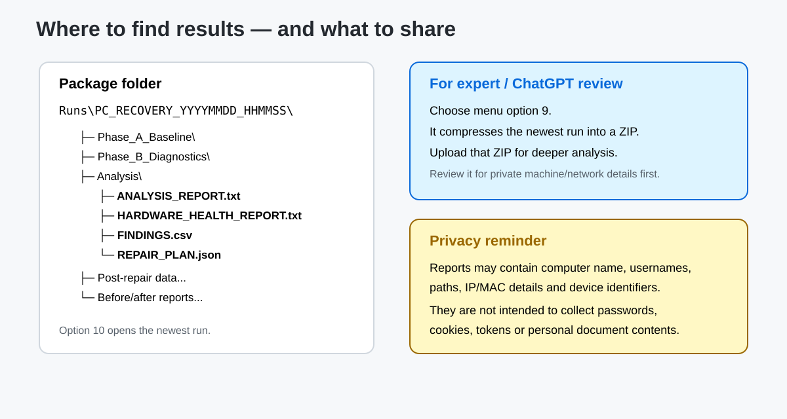

# Windows PC Performance & Hardware Health Recovery Toolkit

A beginner-friendly Windows toolkit for **finding why a PC is slow**, checking whether hardware may be degrading, creating an evidence-based repair plan, applying only conservative repairs, and measuring the result afterward.

> **Start with diagnosis, not random optimization.** The toolkit is intentionally designed to collect evidence before changing Windows.

## What this tool is for

Use it when a Windows PC feels slow, freezes, boots slowly, uses too much CPU/RAM/disk, has unexplained crashes, or may have a failing SSD/HDD/RAM/GPU/other component.

The toolkit can collect and correlate information about:

- CPU utilization and top CPU consumers
- RAM pressure and top memory consumers
- SSD / NVMe / HDD health and Windows storage reliability data
- disk latency, queue length, free space and file-system state
- WHEA hardware events
- memory diagnostic events
- GPU/display-driver events
- Device Manager problem devices
- drivers, services, startup entries and scheduled tasks
- Windows integrity, component store and SFC/DISM state
- Windows Update events
- network, power and battery information
- boot/reliability/application crash information
- virtualization and browser/background-process impact
- hardware-health history across multiple runs

## Requirements

- Windows 10 or Windows 11
- Windows PowerShell 5.1 or newer
- Administrator access is strongly recommended and required for the most complete results and repairs
- Extract the whole package to a normal writable local folder
- No Internet connection is required for the first-pass diagnostics

## Easiest way to use it

1. On the main `mytools` page choose **Code → Download ZIP**, extract it, then open the `Windows-PC-Performance-Recovery` folder. Advanced users can clone the repository instead.
2. Extract the ZIP completely. **Do not run it from inside the ZIP viewer.**
3. Double-click `00_START_HERE.bat`.
4. Approve the Windows Administrator/UAC prompt.
5. Choose **11 — Self-test** first.
6. Choose **1 — Pre-repair phases A + B + C**.
7. Read the generated `ANALYSIS_REPORT.txt`, `HARDWARE_HEALTH_REPORT.txt` and `REPAIR_PLAN.json`.
8. Choose **5 — Repair DRY RUN** to see what would be changed.
9. Only if the dry run looks appropriate, choose **6 — APPLY repair plan**.
10. Reboot if Windows tells you it is required.
11. Choose **7 — Post-repair retest + comparison**.
12. Use **8 — Hardware history** after future runs to see whether hardware error/wear indicators are changing.
13. Use **9 — Export latest run** to create a ZIP for deeper review.

## Recommended sequence

| Step | Menu option | What it does | Changes Windows? |
|---|---:|---|---|
| 1 | 11 | Self-test: checks PowerShell, commands, write access and script syntax | No |
| 2 | 1 | Runs baseline + full diagnostics + local analysis | Diagnostic only |
| 3 | 5 | Shows the repair plan in dry-run mode | No |
| 4 | 6 | Applies only enabled conservative repair actions | **Yes** |
| 5 | 7 | Repeats diagnostics and compares before/after | Diagnostic only |
| 6 | 8 | Builds hardware-health history across runs | No |
| 7 | 9 | Compresses the latest run for sharing/review | No |

## What can it repair automatically?

The current repair engine is deliberately conservative. Depending on the evidence generated by Phase C, it can perform selected low-risk actions such as:

- cleanup of old files in Windows/user temporary locations
- DISM component-store repair when enabled by the evidence/repair plan
- SFC system-file repair when enabled by the evidence/repair plan
- Windows component-store cleanup when enabled
- creation of a restore point where Windows supports it
- repair logging and dry-run preview

It **does not** pretend that software can repair physically failing hardware.

## What it deliberately does NOT do automatically

For safety, the toolkit does not automatically:

- flash BIOS/UEFI or device firmware
- download/install random drivers
- run offline `CHKDSK /F` or `/R`
- run destructive disk/stress tests
- disable startup items or Windows services
- weaken Defender, Firewall, UAC or SmartScreen
- disable/change the pagefile using generic tweaks
- use HPET/BCDEdit gaming tweaks
- run registry cleaners
- uninstall applications
- delete browser profiles, passwords, cookies or personal files
- reset the whole network stack without separate review

See [SAFETY.md](SAFETY.md) and [KNOWN_LIMITATIONS.md](KNOWN_LIMITATIONS.md).

## Where the reports go

Each diagnostic run is stored under the package's `Runs` folder. Important outputs include:

- `Phase_A_Baseline/` — repeated pre-change measurements
- `Phase_B_Diagnostics/` — detailed Windows/hardware evidence
- `Phase_C_Analysis/ANALYSIS_REPORT.txt`
- `Phase_C_Analysis/HARDWARE_HEALTH_REPORT.txt`
- `Phase_C_Analysis/FINDINGS.csv`
- `Phase_C_Analysis/REPAIR_PLAN.json`
- post-repair results and `BEFORE_AFTER_COMPARISON.txt`
- final executive report

## Important hardware-health note

A drive saying **Healthy** in one Windows field does not prove the hardware is perfect. This toolkit also tries to collect storage reliability counters, relevant Event Logs and trend snapshots. However, some SSD/NVMe/HDD health values are vendor-specific or are not exposed by Windows at all. Missing telemetry is reported as missing; it is **not treated as proof of health**.

Likewise, WHEA events, memory diagnostic events, GPU/display errors and Device Manager faults are useful evidence, but a generic script cannot always identify the exact defective physical part without vendor tools or offline testing.

## Current implementation status

This repository publishes the **v2.0 fixed-launcher package**. The launcher/elevation/error-reporting fixes are included. The diagnostic collector is much broader than the automatic analysis/repair engine. Some advanced items are collected but not yet deeply decoded or automatically repaired. See [KNOWN_LIMITATIONS.md](KNOWN_LIMITATIONS.md) for the exact gaps.

## Documentation

- [QUICK_START.md](QUICK_START.md) — beginner step-by-step
- [HOW_IT_WORKS.md](HOW_IT_WORKS.md) — what every phase does
- [SOURCE_MAP.md](SOURCE_MAP.md) — what each script/file is for
- [SAFETY.md](SAFETY.md) — what the toolkit will and will not change
- [TROUBLESHOOTING.md](TROUBLESHOOTING.md) — UAC, PowerShell, blank window, permissions and common failures
- [KNOWN_LIMITATIONS.md](KNOWN_LIMITATIONS.md) — what is partial/not implemented yet
- [Windows_Performance_Hardware_Full_Lifecycle_Master_Prompt_v2_0.md](Windows_Performance_Hardware_Full_Lifecycle_Master_Prompt_v2_0.md) — the full design/master prompt

## Privacy

The diagnostic package is intended to avoid collecting passwords, browser cookies, authentication tokens, document contents or Wi-Fi passwords. Reports can still contain machine-specific information such as computer name, device identifiers, IP/MAC details, paths, usernames or PnP IDs. Review exported reports before posting them publicly.

## License / warranty

This is a troubleshooting utility. Back up important data before making system repairs. A script cannot make a failing physical drive, bad RAM, overheating hardware or a defective power supply healthy. If the toolkit reports serious storage or WHEA warnings, prioritize data protection and hardware investigation over optimization.
