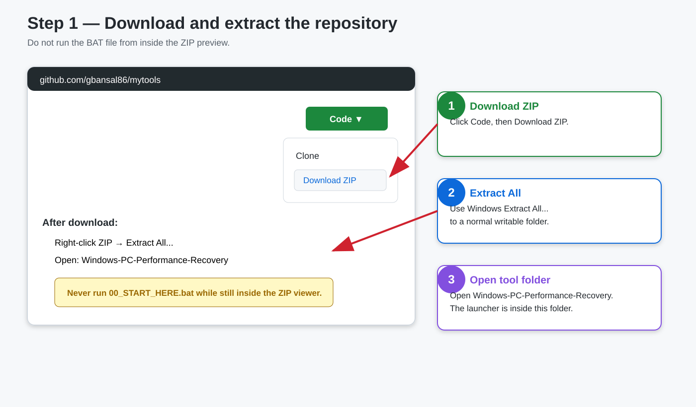
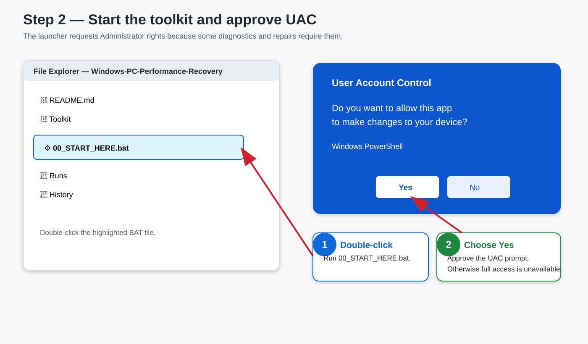
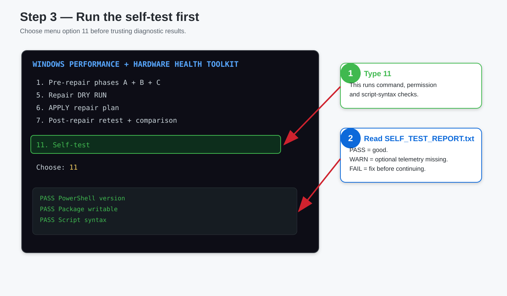
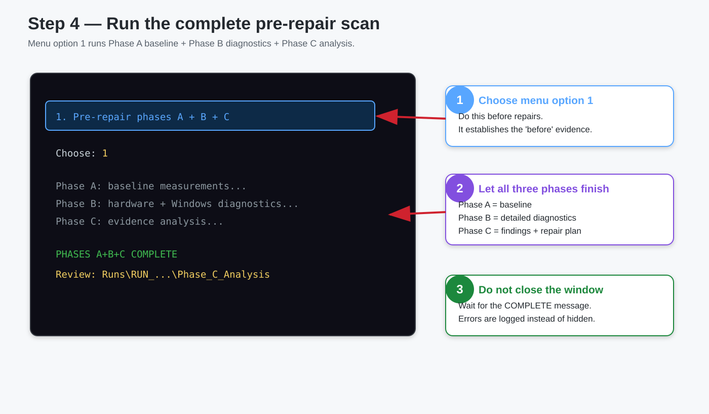
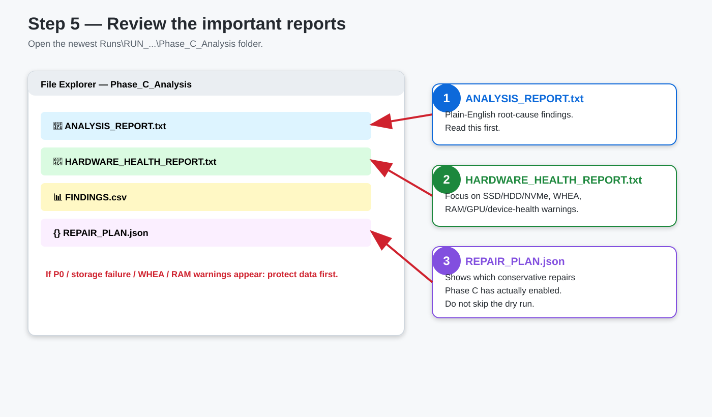
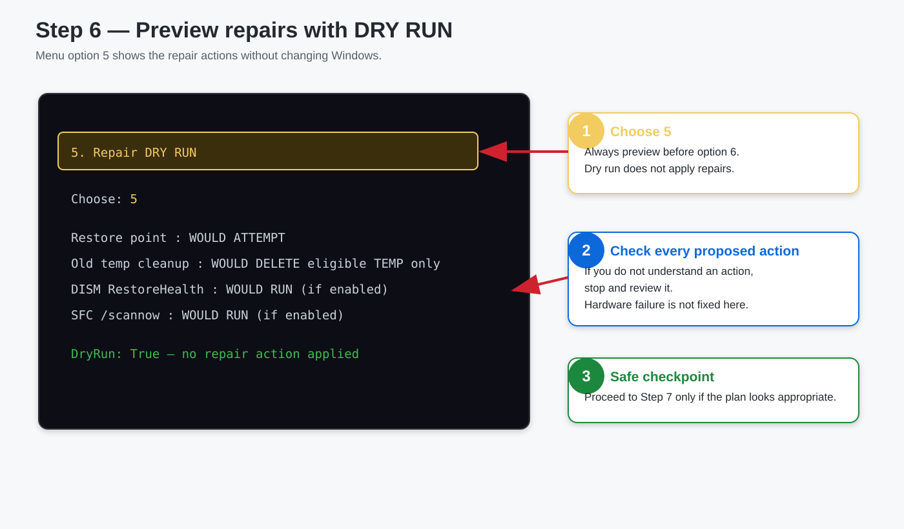
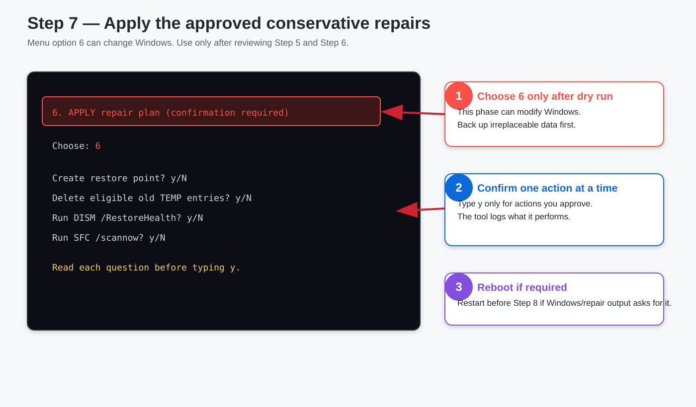
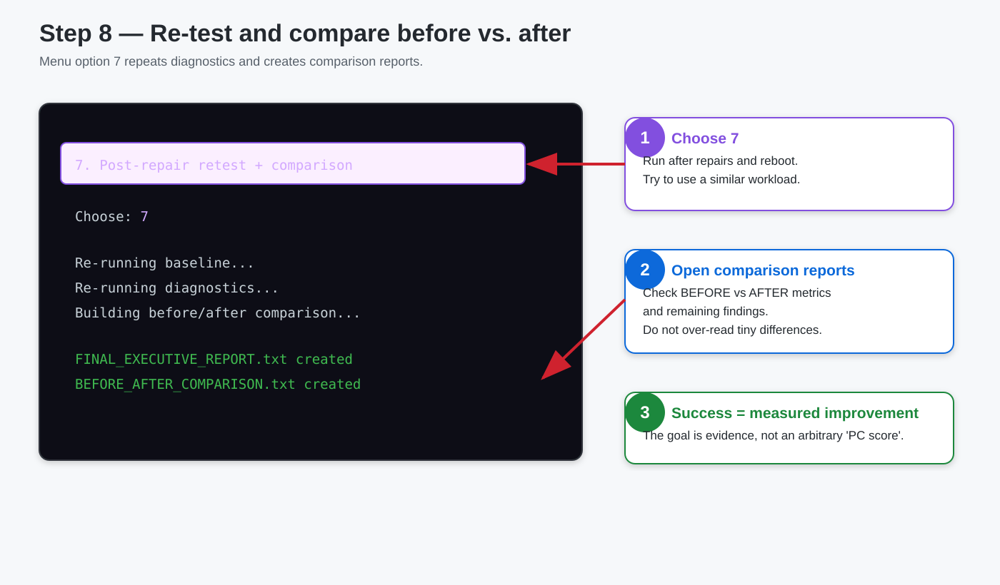
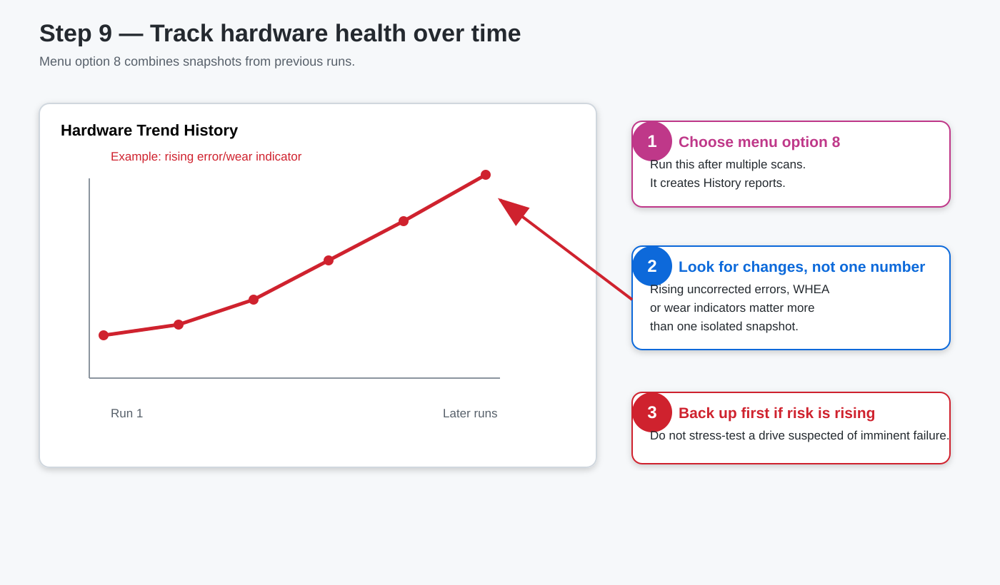
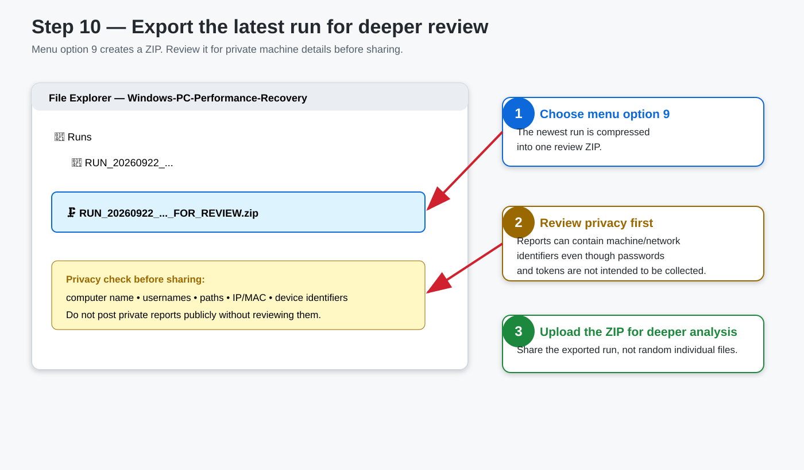

# Visual Step-by-Step Guide

This guide is for users who prefer pictures over command-line instructions. Every image below uses **numbered callouts, arrows, highlighted buttons/files, and the exact menu option to choose**.

## Step 1 — Download and extract



**What to do:** On the main `mytools` page choose **Code → Download ZIP**, extract it, then open `Windows-PC-Performance-Recovery`.

---

## Step 2 — Run the launcher and approve UAC



**What to do:** Double-click `00_START_HERE.bat`, then choose **Yes** on the Windows User Account Control prompt.

---

## Step 3 — Run Self-test



**Menu option:** `11`

Check `SELF_TEST_REPORT.txt`. Required `FAIL` items should be fixed before continuing.

---

## Step 4 — Run the full pre-repair scan



**Menu option:** `1`

This runs Phase A baseline, Phase B diagnostics and Phase C analysis.

---

## Step 5 — Review the reports



Open the newest:

```text
Runs\RUN_...\Phase_C_Analysis\
```

Read these first:

```text
ANALYSIS_REPORT.txt
HARDWARE_HEALTH_REPORT.txt
FINDINGS.csv
REPAIR_PLAN.json
```

If the reports indicate possible failing storage, serious WHEA errors, or RAM instability, **protect important data first**.

---

## Step 6 — Preview repairs



**Menu option:** `5`

This is **DRY RUN**. It previews the repair phase without intentionally applying repair actions.

---

## Step 7 — Apply approved repairs



**Menu option:** `6`

This can change Windows. Read every confirmation question. Only approve actions you understand.

---

## Step 8 — Re-test after repair



**Menu option:** `7`

This repeats measurements and creates the before/after comparison and final report. Use similar workload conditions when comparing performance.

---

## Step 9 — Track hardware health over time



**Menu option:** `8`

Repeated increases in hardware errors/wear indicators can be more meaningful than one isolated scan.

---

## Step 10 — Export results for deeper review



**Menu option:** `9`

The toolkit creates a ZIP of the latest run. Review it for computer names, usernames, paths, IP/MAC information and device identifiers before sharing it publicly.

---

## Recommended menu sequence

```text
11  → Self-test
1   → Baseline + diagnostics + analysis
5   → Repair DRY RUN
6   → Apply approved repairs
7   → Re-test and compare
8   → Hardware history
9   → Export latest run
```

**Never skip from option 1 straight to option 6 without reviewing the analysis and dry run.**
