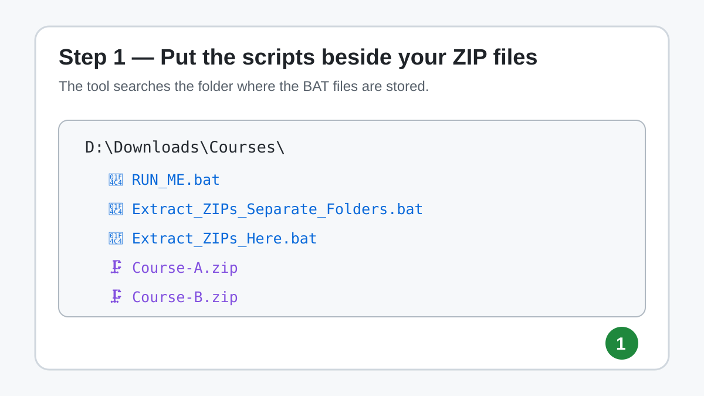
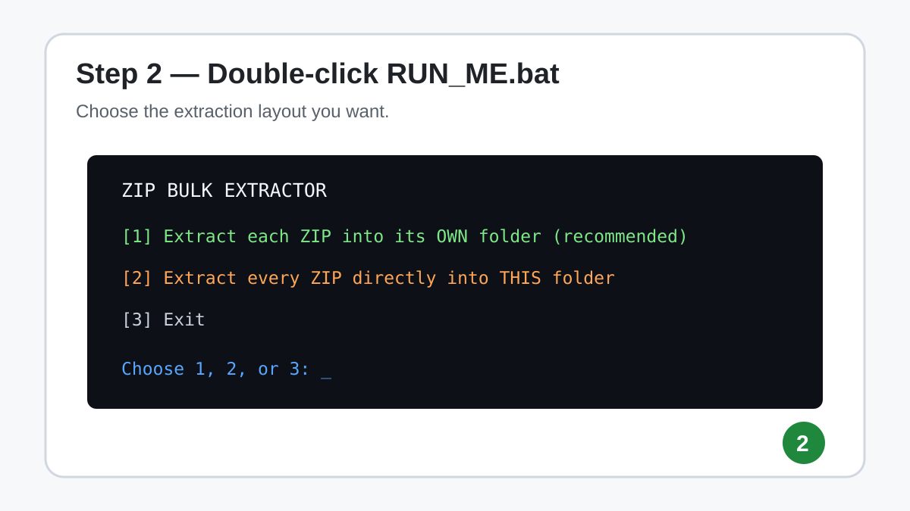
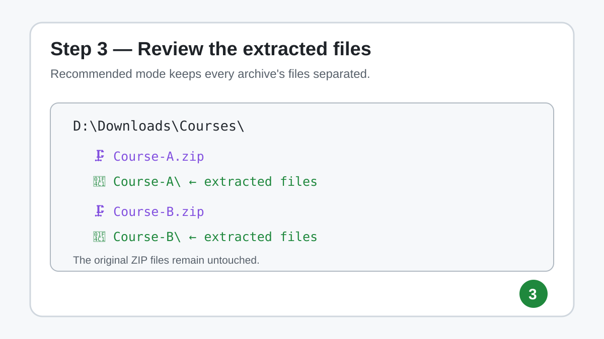

# ZIP Bulk Extractor for Windows

A tiny, beginner-friendly Windows utility that extracts **all `.zip` files in one folder** with a double-click.

It provides two modes:

1. **Each ZIP into its own folder — recommended**
2. **All ZIP contents directly into the current folder**

No Python, 7-Zip, WinRAR, installation, or administrator rights are required for normal ZIP archives.

> This is intentionally a simple ZIP-only utility. For archives-inside-archives, extensionless archives, ZST, and other advanced extraction jobs, use [Nested Archive Extractor](../Nested-Archive-Extractor/).

## Visual quick start

### 1. Put the scripts beside the ZIP files



### 2. Double-click `RUN_ME.bat`



### 3. Review the result



## Download / files

| File | What a beginner should do with it |
|---|---|
| **`RUN_ME.bat`** | Start here. Double-click it and choose option 1 or 2. |
| `Extract_ZIPs_Separate_Folders.bat` | Direct launcher for the recommended "one folder per ZIP" mode. |
| `Extract_ZIPs_Here.bat` | Direct launcher for "extract everything here" mode. |
| `QUICK_START.txt` | Offline mini-instructions you can open in Notepad. |
| `docs/HOW_IT_WORKS.md` | Plain-English explanation, limitations, security notes, and troubleshooting. |

## Requirements

- Windows 10 or Windows 11
- Windows PowerShell with `Expand-Archive` (normally already included)
- One or more ordinary `.zip` files

**Not required:** Python, pip, Java, 7-Zip, WinRAR, admin rights, internet access.

## Recommended method: one folder per ZIP

Suppose you have:

```text
D:\Courses\
    Course-A.zip
    Course-B.zip
    RUN_ME.bat
    Extract_ZIPs_Separate_Folders.bat
    Extract_ZIPs_Here.bat
```

Choose **option 1** in `RUN_ME.bat`.

The result is:

```text
D:\Courses\
    Course-A.zip
    Course-A\
        ...files extracted from Course-A.zip...

    Course-B.zip
    Course-B\
        ...files extracted from Course-B.zip...
```

The ZIP archives themselves remain in place.

## Same-folder mode

Choose **option 2** if you specifically want all archive contents merged into the current folder.

Before:

```text
D:\Files\
    A.zip
    B.zip
    RUN_ME.bat
```

After:

```text
D:\Files\
    A.zip
    B.zip
    file-from-A.txt
    file-from-B.pdf
    some-folder\
```

### Important warning

Same-folder mode uses PowerShell's `-Force` option. If two archives contain the same destination path, or an existing file already has that path, the later extraction can **overwrite** it.

Use the separate-folder mode when you are unsure.

## Exactly how to use it

1. Download this tool folder from the repository.
2. Copy the three BAT files into the folder containing your ZIP archives.
3. Double-click **`RUN_ME.bat`**.
4. Press **1** for separate folders or **2** for direct same-folder extraction.
5. The window shows `[EXTRACT]`, then `[OK]` or `[FAILED]` for each ZIP.
6. When finished, review the destination folder.
7. Your original ZIP files are still there.

## What it does and does not do

| Behavior | Supported? |
|---|---:|
| Extract all ZIP files beside the script | ✅ |
| Keep original ZIP files | ✅ |
| Paths containing spaces | ✅ |
| One destination folder per ZIP | ✅ |
| Merge ZIP contents into the same folder | ✅ |
| Work without third-party archive software | ✅ |
| Search subfolders recursively | ❌ |
| Extract ZIPs found inside extracted ZIPs recursively | ❌ |
| RAR / 7Z / TAR / ZST | ❌ |
| Password-protected ZIP entry | ❌ |
| Delete original ZIPs automatically | ❌ |
| Upload files anywhere | ❌ |

## Safety and privacy

- The scripts operate **locally on your PC**.
- They do not upload files or filenames.
- They do not delete the original ZIPs.
- They do not run extracted files.
- They can overwrite existing destination files because extraction uses `-Force`.
- Extract only archives you trust; successfully extracting a file does not mean that file is safe to open.

## Why there are two modes

**Separate folders** are easier to review and reduce accidental mixing between unrelated archives.

**Same folder** is useful when many ZIPs are intentionally pieces of one directory, but it carries a higher overwrite risk.

## Troubleshooting

**Nothing happens / no ZIP files are found**  
Make sure the BAT files are physically in the same folder as the ZIP files. This utility does not scan subfolders.

**A ZIP shows `[FAILED]`**  
Read the PowerShell error printed immediately above it. Common causes are a damaged archive, an encrypted/password-protected ZIP, incomplete download, permissions, or a file that is not really a valid ZIP.

**I need archives inside archives extracted too**  
Use [Nested Archive Extractor](../Nested-Archive-Extractor/), which is designed for recursive/nested jobs.

**Can I inspect the program before running it?**  
Yes. Every file is plain text. Right-click any `.bat` file and open it in Notepad. The scripts are heavily commented for that reason.

## Technical summary

The scripts loop over `*.zip` files and call the built-in PowerShell `Expand-Archive` command. They store full source and destination paths in environment variables before passing them to PowerShell, which keeps the command easier to understand and handles ordinary paths containing spaces.

For a line-by-line beginner explanation, read [How it works](docs/HOW_IT_WORKS.md).

## Scope

This tool is intentionally narrow: **bulk ZIP extraction in one Windows folder**. Keeping it small makes it easy to audit, copy, and use when a full archive manager would be unnecessary.
